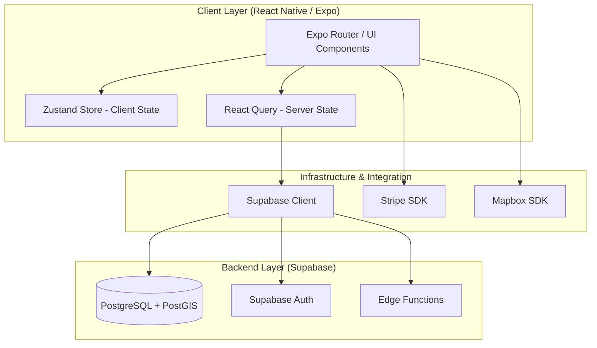
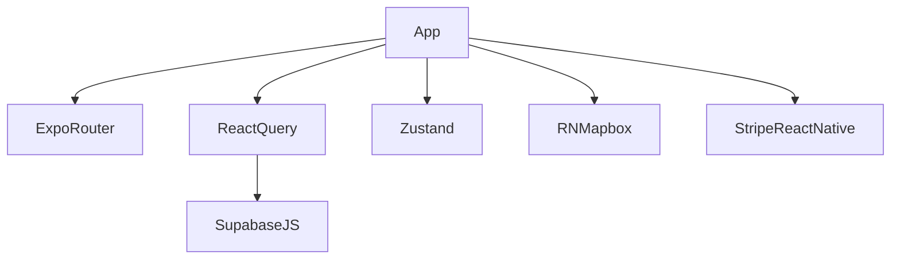

# kaelo-expo - Architecture Documentation

## 1. Project Structure

### Directory Layout
- `app/`: Expo Router application entry points and page definitions (controllers/handlers).
- `assets/`: Static resources including fonts and images.
- `docs/`: Project documentation and requirement documents.
- `migrations/`: Database migration scripts for Supabase.
- `src/`: Main source code directory containing all feature-based logic and shared utilities.
  - `config/`: Application configuration (Environment variables, Mapbox setup).
  - `constants/`: Global constants (e.g., Colors).
  - `features/`: Feature-driven modules (auth, businesses, favorites, metrics, notifications, offline, orders, payments, profile, reviews, routes, wallet).
  - `lib/`: Third-party library integrations and clients (React Query, Supabase).
  - `shared/`: Shared, reusable application code (components, hooks, store, tasks).
  - `types/`: Global TypeScript definitions (e.g., database types).
- `supabase/`: Backend functions and configuration for Supabase.

### Module Organization
The project follows a feature-driven architecture within `src/features`. Each core domain area (e.g., `routes`, `auth`, `businesses`) is encapsulated as a standalone module containing its own data fetching, components, and logic.

### Package Structure
- `@/features/*`: Feature-specific logic.
- `@/shared/*`: Global state, UI components, and hooks.
- `@/lib/*`: Core infrastructure integration (Supabase, React Query).

### Build Configuration
The project is an Expo managed workflow application utilizing `package.json` for dependency management and `app.json` for Expo application configuration. Builds are expected to run via EAS Build.

## 2. Core Components

### Application Entry Points
- `app/_layout.tsx`: Root layout and navigation provider. Handles authentication state initialization, routing guards, and global providers (QueryClient, Stripe, Theme).

### Controllers/Handlers
- File-based routing in the `app/` directory (e.g., `app/(tabs)/_layout.tsx`, `app/route-detail.tsx`, `app/cart.tsx`) acts as the presentation layer and view controllers for the mobile application.

### Service Layer
- Handled primarily by feature-specific custom hooks and `@tanstack/react-query` hooks that encapsulate Supabase interactions and business logic.
- `src/lib/react-query.ts` configures the global query client with caching and retry strategies.

### Data Access Layer
- `@supabase/supabase-js` is used directly for database queries, managed within React Query queries/mutations. `src/lib/supabase.ts` initializes the client with `AsyncStorage` for session persistence.

### Models/Entities
- Defined in `src/types/database.types.ts` and managed via Supabase PostgreSQL schemas (as seen in `migrations/`). Key entities include Profiles, Routes, Businesses, Orders, Route Purchases, Reviews, and Route Completions. PostGIS `GEOMETRY` is heavily used for spatial queries.

### Configuration
- Environment variables are managed via `src/config/env.ts` (using `zod` for validation).
- Mapbox configuration is initialized in `src/config/mapbox.ts`.

## 3. Architecture Overview

### Architectural Style
- **Mobile Client:** Feature-driven React Native (Expo) architecture with Global State Management (Zustand) and Server State Management (React Query).
- **Backend:** Backend-as-a-Service (BaaS) using Supabase (PostgreSQL, Edge Functions, Auth, Storage) acting as a serverless monolithic API.

### Component Diagram

### Data Flow
1. User interacts with UI components in `app/`.
2. UI triggers a React Query mutation or Zustand state change.
3. React Query invokes the Supabase client (`src/lib/supabase.ts`).
4. Supabase client communicates with the Supabase PostgREST API or Edge Functions.
5. Realtime updates (if configured) are pushed via Supabase WebSockets.

### Communication Patterns
- RESTful HTTP requests via Supabase PostgREST for CRUD operations.
- Asynchronous SDK calls for third-party services (Stripe, Mapbox).
- Reactive state updates using TanStack Query.

### Design Patterns
- Feature-driven module encapsulation.
- Provider Pattern (Theme, React Query, Stripe in `app/_layout.tsx`).
- React Hooks for dependency injection and logic reuse.

## 4. Detailed Component Analysis

### Navigation / Routing (`app/_layout.tsx`)
- **Purpose**: Root initialization and routing guard.
- **Responsibilities**: Initializes fonts, handles authentication redirects based on Zustand state, provides global context (Stripe, React Query).
- **Dependencies**: `expo-router`, `@tanstack/react-query`, `@stripe/stripe-react-native`, `zustand` (Auth Store).

### Supabase Client (`src/lib/supabase.ts`)
- **Purpose**: Backend communication wrapper.
- **Responsibilities**: Initializes Supabase client with environment variables and attaches `AsyncStorage` for persistent session management.
- **Dependencies**: `@supabase/supabase-js`, `@react-native-async-storage/async-storage`, `src/config/env.ts`.

### Query Client (`src/lib/react-query.ts`)
- **Purpose**: Server state caching configuration.
- **Responsibilities**: Sets global `staleTime`, `gcTime`, and `retry` logic for data fetching.
- **Dependencies**: `@tanstack/react-query`.

## 5. Dependency Analysis

### Framework Stack
- React Native: 0.81.5
- Expo: ~54.0.33
- Expo Router: ~6.0.23

### Dependency Categories
- **Web/HTTP & State**: `@tanstack/react-query` (Server State), `zustand` (Client State).
- **Database/ORM**: `@supabase/supabase-js` (BaaS client).
- **Mapping & Location**: `@rnmapbox/maps`, `expo-location`.
- **Payments**: `@stripe/stripe-react-native`.
- **UI & Animations**: `react-native-reanimated`, `@expo/vector-icons`, `react-native-safe-area-context`.
- **Storage**: `@react-native-async-storage/async-storage`, `expo-file-system`.
- **Utilities**: `zod` (validation).

### Dependency Graph

## 6. Performance Considerations

### Database Access Patterns
- Extensive use of PostGIS spatial queries (`ST_DWithin`, `GIST` indexes). The choice of `GEOMETRY` over `GEOGRAPHY` provides better performance for localized routing.
- Direct database access via PostgREST minimizes backend overhead but requires careful Row Level Security (RLS) implementation.

### Caching Strategy
- `@tanstack/react-query` provides application-level caching with default `staleTime` of 5 minutes and `gcTime` of 30 minutes, preventing redundant network requests.

### Asynchronous Processing
- Used primarily for data fetching, location tracking, and payment processing.
- Background tasks (via `expo-task-manager`) may be required for tracking ongoing route completions.

### Resource Management
- Mapbox instances and WebSockets (Supabase Realtime) must be properly unmounted to prevent memory leaks in the mobile client.
- `AsyncStorage` handles persistent sessions, ensuring smooth offline-to-online transitions.

### Scalability Analysis
- Horizontal scaling is managed seamlessly by the Supabase managed infrastructure. Mapbox is used via its free tier but will require optimization (e.g., caching map tiles) as active users scale.

### Performance Recommendations
- Implement pagination or infinite scrolling for large datasets (e.g., routes, businesses) utilizing React Query's `useInfiniteQuery`.
- Ensure heavy Mapbox rendering does not block the JavaScript thread by utilizing React Native's native components efficiently.

## 7. Technical Debt & Recommendations

### Identified Issues
- Direct use of PostGIS `GEOMETRY` may result in minor inaccuracies for very long routes (>200km), though acceptable for current localized requirements.
- Combining local state and remote queries might lead to synchronization issues if optimistic updates are not rigorously tested.

### Improvement Opportunities
- Pre-cache common database queries on edge nodes using Supabase Edge Functions or Redis (if implemented).
- Implement robust offline-first capabilities using SQLite or WatermelonDB if offline route tracking is a critical feature, replacing basic `AsyncStorage`.

### Best Practice Alignment
- The feature-driven architecture aligns well with modern React Native best practices.
- The use of Zod for environment validation and forms ensures strong type safety and runtime validation.