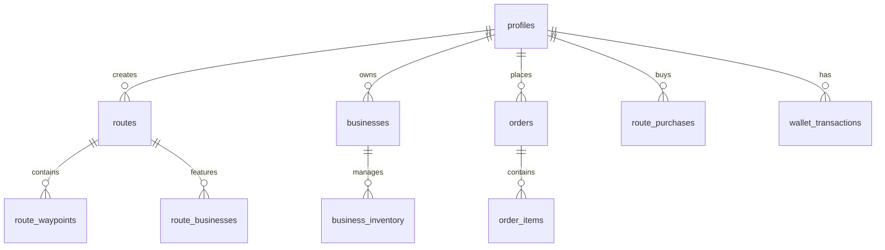

# 🚴‍♂️ Kaelo - Plataforma de Rutas Ciclistas y Comercio Local

<div align="center">


**Una plataforma móvil que conecta ciclistas con rutas documentadas y comercios locales en Yucatán**

[🚀 Inicio Rápido](#-inicio-rápido) • [📱 Características](#-características) • [🏗️ Arquitectura](#️-arquitectura) • [📚 Documentación](#-documentación)

</div>

---

## 📖 Sobre el Proyecto

**Kaelo** es una aplicación móvil diseñada para revolucionar el cicloturismo en Yucatán, conectando tres actores clave del ecosistema:

- 🚴‍♀️ **Ciclistas**: Descubren rutas documentadas, servicios cercanos y pueden realizar pre-órdenes
- 🏪 **Comercios Locales**: Ganan visibilidad y pueden recibir pedidos anticipados de ciclistas
- ✍️ **Creadores de Contenido**: Monetizan su conocimiento local creando y vendiendo rutas premium

### 🎯 Problema que Resolvemos

Los ciclistas en Yucatán enfrentan tres problemas críticos:

1. **Discovery Gap**: No existe un sistema centralizado para descubrir rutas documentadas
2. **Service Location Failure**: Dificultad para localizar servicios (hidratación, comida, mecánica) durante trayectos
3. **Planning Overhead**: Imposibilidad de pre-planificar paradas optimizadas

**Datos del mercado:**

- 73% de ciclistas reportan cancelar rutas por falta de información
- Costo de guía turístico: $500-800 MXN/día (barrera de entrada)
- ~30% de pérdida de ventas potenciales para comercios locales por baja visibilidad

### 💡 Nuestra Solución

Sistema **triple-stream** que genera valor para todos los participantes:

1. **Route Marketplace**: Sistema freemium con rutas gratuitas y premium
2. **Pre-Order System**: Pedidos anticipados con comisión del 10%
3. **Creator Monetization**: Creadores ganan 85% por cada venta de ruta premium

---

## ✨ Características

### 🗺️ Sistema de Rutas

- **Descubrimiento Inteligente**: Filtros por dificultad, distancia, tipo de terreno
- **Rutas Premium**: Sistema de monetización para creadores (85% de comisión)
- **Navegación Offline**: Mapas descargables para zonas sin cobertura
- **Waypoints Documentados**: Puntos de interés, paradas sugeridas, servicios
- **Métricas en Tiempo Real**: Tracking GPS durante la navegación activa

### 🏪 Sistema de Comercios

- **Perfiles de Negocio**: Menú digital con fotos, precios y horarios
- **Pre-Órdenes**: Sistema de pedidos anticipados con notificaciones en tiempo real
- **Inventario Básico**: Gestión de disponibilidad de productos
- **Dashboard Web**: Panel de control para gestionar órdenes y perfil

### 💰 Sistema de Monetización

- **Wallet Digital**: Balance, historial de transacciones y retiros
- **Dashboard de Creador**: Analytics de ventas, earnings y rendimiento de rutas
- **Dual Payment**: Stripe (online) y efectivo (pago en recogida)
- **Comisiones**: 15% en ventas de rutas, 10% en órdenes

### 📊 Métricas Personales

- **Activity Tracking**: Registro de actividades con GPS
- **Performance Analytics**: Comparación con estadísticas históricas
- **Achievements System**: Sistema de logros y objetivos
- **Monthly Stats**: Agregación mensual de métricas

---

## 🏗️ Arquitectura

### Stack Tecnológico

#### Frontend (Mobile)

```
React Native (Expo SDK 54)
├── State Management: Zustand
├── Navigation: Expo Router (file-based)
├── Maps: @rnmapbox/maps (Mapbox GL)
├── API Client: TanStack Query
├── Forms: React Hook Form + Zod
└── Storage: AsyncStorage (offline-first)
```

#### Backend (Serverless)

```
Supabase Platform
├── Database: PostgreSQL 15 + PostGIS
├── Auth: Supabase Auth (JWT)
├── Storage: Supabase Storage (S3)
├── Realtime: WebSockets
└── Edge Functions: Deno runtime
```

#### Servicios Externos

- **Maps**: Mapbox (50k MAU free tier)
- **Payments**: Stripe + MercadoPago (fallback)
- **Monitoring**: Sentry
- **CI/CD**: GitHub Actions + EAS Build

### Estructura del Proyecto

```
kaelo-app-production/
├── app/                          # Expo Router screens
│   ├── (auth)/                   # Auth flow (login, register)
│   ├── (tabs)/                   # Tab navigation (home, routes, businesses, profile)
│   └── _layout.tsx               # Root layout
├── src/
│   ├── features/                 # Feature-based modules
│   │   ├── auth/                 # Authentication
│   │   ├── routes/               # Routes system
│   │   ├── businesses/           # Business profiles
│   │   ├── orders/               # Pre-order system
│   │   ├── payments/             # Payment integration
│   │   ├── wallet/               # Creator wallet
│   │   ├── creator/              # Creator dashboard
│   │   ├── metrics/              # Personal metrics
│   │   ├── navigation/           # GPS navigation
│   │   ├── achievements/         # Gamification
│   │   └── notifications/        # Push notifications
│   ├── lib/                      # Shared utilities
│   ├── shared/                   # Shared components
│   ├── types/                    # TypeScript types
│   └── config/                   # Configuration
├── migrations/                   # Database migrations
├── docs/                         # Comprehensive documentation
├── android/                      # Android native code
├── ios/                          # iOS native code
└── assets/                       # Images and fonts
```

### Modelo de Datos (Simplificado)



---

## 🚀 Inicio Rápido

### Prerrequisitos

- Node.js 18+ y npm/yarn
- Expo CLI: `npm install -g expo-cli`
- iOS Simulator (Mac) o Android Emulator
- Cuenta de Supabase (gratis)
- Mapbox Access Token (gratis hasta 50k MAU)

### Instalación

1. **Clonar el repositorio**

   ```bash
   git clone https://github.com/tuusuario/kaelo-app-production.git
   cd kaelo-app-production
   ```

2. **Instalar dependencias**

   ```bash
   npm install

   # Para iOS (solo Mac)
   cd ios && pod install && cd ..
   ```

3. **Configurar variables de entorno**

   Crea un archivo `.env` en la raíz:

   ```env
   EXPO_PUBLIC_SUPABASE_URL=tu_supabase_url
   EXPO_PUBLIC_SUPABASE_ANON_KEY=tu_anon_key
   EXPO_PUBLIC_MAPBOX_ACCESS_TOKEN=tu_mapbox_token
   ```

4. **Inicializar base de datos**

   ```bash
   # Aplicar migraciones (en Supabase Dashboard > SQL Editor)
   # Copiar y ejecutar archivos de migrations/reference/ en orden
   ```

5. **Iniciar desarrollo**

   ```bash
   # Modo desarrollo
   npm start

   # iOS
   npm run ios

   # Android
   npm run android
   ```

### Build para Producción

```bash
# iOS
eas build --platform ios --profile production

# Android
eas build --platform android --profile production
```

---

## 📱 Uso

### Para Ciclistas

1. **Descubre Rutas**: Explora el catálogo con filtros por dificultad y distancia
2. **Compra Rutas Premium**: Accede a rutas exclusivas de creadores locales
3. **Pre-Ordena**: Realiza pedidos anticipados en comercios de la ruta
4. **Navega Offline**: Descarga mapas y navega sin conexión
5. **Trackea tu Progreso**: Monitorea métricas personales y logros

### Para Comercios

1. **Crea tu Perfil**: Dashboard web con menú digital y horarios
2. **Recibe Órdenes**: Notificaciones en tiempo real de pedidos
3. **Gestiona Inventario**: Actualiza disponibilidad de productos
4. **Cobra Comisión**: Recibe pagos con comisión del 10%

### Para Creadores

1. **Crea Rutas**: Documenta rutas con waypoints y metadata
2. **Monetiza**: Establece precio para rutas premium ($50-150 MXN)
3. **Analytics**: Dashboard con ventas, earnings y performance
4. **Retira Ganancias**: Sistema de wallet con historial de transacciones

---

## 🧪 Testing

```bash
# Ejecutar tests
npm test

# Coverage
npm run test:coverage

# E2E tests (requiere emulador/simulador)
npm run test:e2e
```

---

## 📚 Documentación

La documentación completa del proyecto está en la carpeta [`/docs`](./docs):

### Documentos Principales

| Documento                                            | Descripción                                 |
| ---------------------------------------------------- | ------------------------------------------- |
| [📋 Project Overview](./docs/01-project-overview.md) | Visión general, objetivos y research        |
| [📝 Requirements](./docs/02-requirements.md)         | Requerimientos funcionales y no funcionales |
| [🏗️ Architecture](./docs/03-architecture.md)         | Arquitectura técnica y modelo de datos      |
| [⚠️ Edge Cases](./docs/04-edge-cases.md)             | Casos límite y manejo de errores            |
| [✅ Testing Strategy](./docs/05-testing-strategy.md) | Estrategia de pruebas                       |
| [📊 Monitoring](./docs/07-monitoring.md)             | Métricas y observabilidad                   |
| [🔒 Security](./docs/09-security.md)                 | Políticas RLS y seguridad                   |
| [🚀 Deployment](./docs/10-deployment.md)             | CI/CD y ambientes                           |

### Quick Links

- 📖 [Índice Completo](./docs/INDEX.md)
- 🔄 [Changelog](./docs/CHANGELOG.md)
- 🎯 [Quick Start Guide](./docs/QUICKSTART.md)
- 📊 [Impact Matrix](./docs/IMPACT-MATRIX.md)

---

## 🛣️ Roadmap

### ✅ Phase 1 - MVP (Mes 1-3) - **COMPLETADO**

- [x] Autenticación y perfiles
- [x] Sistema de rutas (CRUD)
- [x] Navegación offline
- [x] Sistema de pre-órdenes
- [x] Integración de pagos (Stripe)
- [x] Dashboard de creadores
- [x] Sistema de wallet

### 🚧 Phase 2 - Gamificación (Mes 4-5) - **EN PROGRESO**

- [x] Sistema de métricas personales
- [x] Activity tracking con GPS
- [x] Sistema de achievements
- [ ] Sistema de objetivos (goals)
- [ ] Coupons gamificados
- [ ] Sponsored segments

### 📅 Phase 3 - Escalabilidad (Mes 6+)

- [ ] Integración con Strava/Garmin
- [ ] Social features (shares, comments)
- [ ] PWA para ciclistas
- [ ] Sistema de suscripciones
- [ ] API pública para partners
- [ ] Analytics avanzado (ML predictions)

---

## 🤝 Contribuir

Las contribuciones son bienvenidas! Por favor:

1. Fork el proyecto
2. Crea tu feature branch (`git checkout -b feature/AmazingFeature`)
3. Commit tus cambios (`git commit -m 'feat: Add some AmazingFeature'`)
4. Push al branch (`git push origin feature/AmazingFeature`)
5. Abre un Pull Request

### Convenciones de Commit

Seguimos [Conventional Commits](https://www.conventionalcommits.org/):

```
feat: Nueva característica
fix: Bug fix
docs: Cambios en documentación
style: Formato, linting
refactor: Refactorización de código
test: Tests
chore: Mantenimiento
```

---

## 📄 Licencia

Este proyecto es privado y confidencial. Todos los derechos reservados © 2026 Kaelo.

---

## 👥 Equipo

- **Jonathan** - Product Owner & Lead Developer

---

## 📞 Contacto

- **Email**: jonathan@kaelo.app
- **Website**: [kaelo.app](https://kaelo.app) _(coming soon)_
- **Issues**: [GitHub Issues](https://github.com/tuusuario/kaelo-app-production/issues)

---

## 🙏 Agradecimientos

- [Expo](https://expo.dev/) - Por el increíble framework
- [Supabase](https://supabase.com/) - Backend como servicio
- [Mapbox](https://www.mapbox.com/) - Mapas y geocoding
- [TanStack Query](https://tanstack.com/query) - Gestión de estado del servidor
- La comunidad ciclista de Yucatán 🚴‍♂️

---

<div align="center">

**Hecho con ❤️ en Yucatán, México**

[⬆ Volver arriba](#-kaelo---plataforma-de-rutas-ciclistas-y-comercio-local)

</div>
