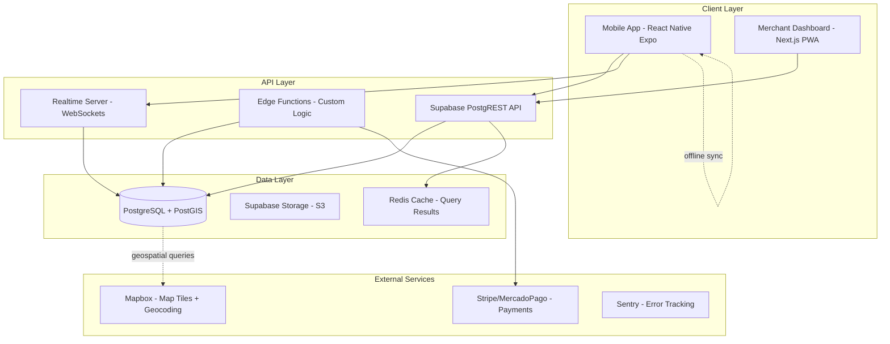
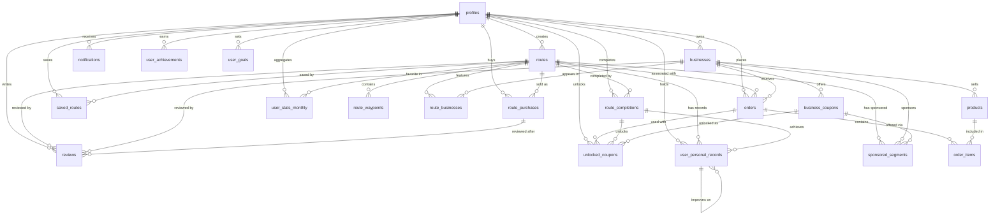

# 03 - Architecture

**Version:** 1.2
**Last Updated:** Enero 29, 2026

## 10. ARQUITECTURA DEL SISTEMA

### 10.1 Stack Tecnológico Detallado

#### Frontend (Mobile)
- Framework: React Native (Expo SDK 51+)
- State Management: Zustand (lightweight, devtools support)
- Navigation: Expo Router (file-based routing)
- Maps: React Native Maps + Mapbox GL
- Offline Storage: @react-native-async-storage/async-storage
- API Client: TanStack Query (caching + optimistic updates)
- Forms: React Hook Form + Zod validation
- UI Library: React Native Paper (Material Design)

#### Backend (Serverless)
- BaaS: Supabase (PostgreSQL + Auth + Storage + Realtime)
- Database: PostgreSQL 15 con PostGIS extension
- Authentication: Supabase Auth (JWT-based)
- File Storage: Supabase Storage (S3-compatible)
- Edge Functions: Supabase Edge Functions (Deno runtime)
- Realtime: Supabase Realtime (WebSocket-based)

#### Infrastructure
- Hosting: Supabase Cloud (auto-scaling)
- CDN: Supabase CDN (global edge network)
- Maps: Mapbox (free tier: 50k monthly active users)
- Payments: Stripe (Mexico support) / MercadoPago (fallback)
- Monitoring: Sentry (error tracking) + Supabase Logs
- Analytics: PostHog (self-hosted opcional)
- CI/CD: GitHub Actions + EAS Build (Expo)

### 10.2 System Architecture Diagram



### 10.3 Data Model (Complete Schema)

#### Entity Relationship Diagram



#### Core Tables

```sql
-- ============================================
-- USERS & AUTHENTICATION
-- ============================================

-- Extended user profiles (references Supabase Auth)
CREATE TABLE profiles (
    id UUID PRIMARY KEY REFERENCES auth.users,
    email TEXT UNIQUE NOT NULL,
    full_name TEXT,
    avatar_url TEXT,
    phone TEXT,
    bio TEXT,

    -- Wallet & Monetization
    wallet_balance NUMERIC(10,2) DEFAULT 0.00,
    is_creator BOOLEAN DEFAULT FALSE,
    is_business_owner BOOLEAN DEFAULT FALSE,
    creator_rating NUMERIC(3,2) DEFAULT 0.00,
    total_routes_sold INTEGER DEFAULT 0,
    total_earnings NUMERIC(10,2) DEFAULT 0.00,

    -- Preferences
    preferences JSONB DEFAULT '{}', -- cycling level, dietary restrictions, language

    created_at TIMESTAMPTZ DEFAULT NOW(),
    updated_at TIMESTAMPTZ DEFAULT NOW()
);

-- ============================================
-- ROUTES SYSTEM
-- ============================================

-- Cycling routes with geospatial data
CREATE TABLE routes (
    id UUID PRIMARY KEY DEFAULT uuid_generate_v4(),
    creator_id UUID REFERENCES profiles(id),
    name TEXT NOT NULL,
    description TEXT,
    slug TEXT UNIQUE NOT NULL,

    -- Geospatial (PostGIS geometry types)
    route_path GEOMETRY(LineString, 4326),
    start_point GEOMETRY(Point, 4326),
    end_point GEOMETRY(Point, 4326),

    -- Route Metrics
    distance_km NUMERIC(6,2) NOT NULL,
    elevation_gain_m INTEGER DEFAULT 0,
    estimated_duration_min INTEGER,
    difficulty TEXT DEFAULT 'moderada' CHECK (difficulty IN ('facil', 'moderada', 'dificil', 'experto')),
    terrain_type TEXT DEFAULT 'asfalto' CHECK (terrain_type IN ('asfalto', 'terraceria', 'mixto')),

    -- Status & Moderation
    status TEXT DEFAULT 'borrador' CHECK (status IN ('borrador', 'en_revision', 'publicado', 'rechazado', 'archivado')),

    -- Monetization
    price NUMERIC(8,2) DEFAULT 0.00,
    is_free BOOLEAN DEFAULT TRUE,

    -- Media
    cover_image_url TEXT,
    photos JSONB DEFAULT '[]', -- array of image URLs
    tags JSONB DEFAULT '[]', -- ['naturaleza', 'cenotes', 'arqueologia']

    -- Location
    municipality TEXT,

    -- Engagement Metrics
    purchase_count INTEGER DEFAULT 0,
    view_count INTEGER DEFAULT 0,
    average_rating NUMERIC(3,2) DEFAULT 0.00,
    total_reviews INTEGER DEFAULT 0,

    created_at TIMESTAMPTZ DEFAULT NOW(),
    updated_at TIMESTAMPTZ DEFAULT NOW(),
    published_at TIMESTAMPTZ
);

CREATE INDEX idx_routes_path ON routes USING GIST(route_path);
CREATE INDEX idx_routes_start_point ON routes USING GIST(start_point);
CREATE INDEX idx_routes_status ON routes(status) WHERE status = 'publicado';

-- Waypoints along routes (POIs)
CREATE TABLE route_waypoints (
    id UUID PRIMARY KEY DEFAULT uuid_generate_v4(),
    route_id UUID REFERENCES routes(id) ON DELETE CASCADE,
    location GEOMETRY(Point, 4326) NOT NULL,
    name TEXT NOT NULL,
    description TEXT,
    waypoint_type TEXT DEFAULT 'otro' CHECK (waypoint_type IN (
        'inicio', 'fin', 'cenote', 'zona_arqueologica', 'mirador',
        'restaurante', 'tienda', 'taller_bicicletas', 'descanso',
        'punto_agua', 'peligro', 'foto', 'otro'
    )),
    image_url TEXT,
    order_index INTEGER DEFAULT 0,
    created_at TIMESTAMPTZ DEFAULT NOW()
);

CREATE INDEX idx_route_waypoints_location ON route_waypoints USING GIST(location);

-- ============================================
-- BUSINESSES SYSTEM
-- ============================================

-- Local businesses along routes
CREATE TABLE businesses (
    id UUID PRIMARY KEY DEFAULT uuid_generate_v4(),
    owner_id UUID REFERENCES profiles(id),
    name TEXT NOT NULL,
    slug TEXT UNIQUE NOT NULL,
    description TEXT,

    -- Location
    location GEOMETRY(Point, 4326) NOT NULL,
    address TEXT NOT NULL,
    municipality TEXT,

    -- Contact
    phone TEXT,
    email TEXT,
    website TEXT,
    whatsapp TEXT,

    -- Business Info
    business_hours JSONB DEFAULT '{}', -- {lun: "8:00-18:00", ...}
    business_type TEXT DEFAULT 'tienda' CHECK (business_type IN (
        'restaurante', 'cafeteria', 'tienda', 'taller_bicicletas',
        'hospedaje', 'tienda_conveniencia', 'mercado', 'otro'
    )),

    -- Media
    cover_image_url TEXT,
    logo_url TEXT,
    photos JSONB DEFAULT '[]',

    -- Status & Configuration
    status TEXT DEFAULT 'pendiente' CHECK (status IN ('pendiente', 'activo', 'pausado', 'rechazado')),
    accepts_advance_orders BOOLEAN DEFAULT TRUE,
    minimum_order_amount NUMERIC(8,2) DEFAULT 0.00,
    advance_order_hours INTEGER DEFAULT 2,

    -- Metrics
    average_rating NUMERIC(3,2) DEFAULT 0.00,
    total_reviews INTEGER DEFAULT 0,
    total_orders INTEGER DEFAULT 0,

    -- Platform Commission
    commission_rate NUMERIC(4,2) DEFAULT 10.00, -- 10%

    created_at TIMESTAMPTZ DEFAULT NOW(),
    updated_at TIMESTAMPTZ DEFAULT NOW()
);

CREATE INDEX idx_businesses_location ON businesses USING GIST(location);
CREATE INDEX idx_businesses_type ON businesses(business_type) WHERE status = 'activo';

-- Many-to-many: Routes featuring Businesses
CREATE TABLE route_businesses (
    id UUID PRIMARY KEY DEFAULT uuid_generate_v4(),
    route_id UUID REFERENCES routes(id) ON DELETE CASCADE,
    business_id UUID REFERENCES businesses(id) ON DELETE CASCADE,
    distance_from_route_m INTEGER,
    order_index INTEGER DEFAULT 0,
    notes TEXT,
    created_at TIMESTAMPTZ DEFAULT NOW(),
    UNIQUE(route_id, business_id)
);

-- Products sold by businesses
CREATE TABLE products (
    id UUID PRIMARY KEY DEFAULT uuid_generate_v4(),
    business_id UUID REFERENCES businesses(id) ON DELETE CASCADE,
    name TEXT NOT NULL,
    description TEXT,
    price NUMERIC(8,2) NOT NULL CHECK (price >= 0),
    category TEXT DEFAULT 'otro' CHECK (category IN (
        'bebidas', 'alimentos', 'snacks', 'reparaciones',
        'refacciones', 'accesorios', 'servicios', 'otro'
    )),
    image_url TEXT,
    is_available BOOLEAN DEFAULT TRUE,
    stock_quantity INTEGER,
    is_cyclist_special BOOLEAN DEFAULT FALSE,
    created_at TIMESTAMPTZ DEFAULT NOW(),
    updated_at TIMESTAMPTZ DEFAULT NOW()
);

CREATE INDEX idx_products_business ON products(business_id) WHERE is_available = TRUE;

-- ============================================
-- ORDERS SYSTEM
-- ============================================

-- Pre-orders placed by cyclists
CREATE TABLE orders (
    id UUID PRIMARY KEY DEFAULT uuid_generate_v4(),
    customer_id UUID REFERENCES profiles(id),
    business_id UUID REFERENCES businesses(id),
    route_id UUID REFERENCES routes(id), -- optional: associated route
    order_number TEXT UNIQUE NOT NULL,

    -- Status State Machine
    status TEXT DEFAULT 'pendiente' CHECK (status IN (
        'pendiente', 'confirmado', 'preparando', 'listo', 'entregado', 'cancelado'
    )),

    -- Pricing
    subtotal NUMERIC(10,2) NOT NULL,
    platform_fee NUMERIC(10,2) NOT NULL,
    total NUMERIC(10,2) NOT NULL,

    -- Timing
    estimated_pickup_time TIMESTAMPTZ NOT NULL,
    actual_pickup_time TIMESTAMPTZ,
    notes TEXT,

    -- Payment
    payment_method TEXT DEFAULT 'efectivo' CHECK (payment_method IN ('tarjeta', 'efectivo', 'wallet')),
    payment_status TEXT DEFAULT 'pendiente' CHECK (payment_status IN ('pendiente', 'pagado', 'reembolsado', 'fallido')),
    stripe_payment_id TEXT,

    created_at TIMESTAMPTZ DEFAULT NOW(),
    updated_at TIMESTAMPTZ DEFAULT NOW()
);

CREATE INDEX idx_orders_customer ON orders(customer_id);
CREATE INDEX idx_orders_business ON orders(business_id, status);
CREATE INDEX idx_orders_status ON orders(status, created_at DESC);

-- Order line items
CREATE TABLE order_items (
    id UUID PRIMARY KEY DEFAULT uuid_generate_v4(),
    order_id UUID REFERENCES orders(id) ON DELETE CASCADE,
    product_id UUID REFERENCES products(id),
    quantity INTEGER NOT NULL CHECK (quantity > 0),
    unit_price NUMERIC(8,2) NOT NULL,
    total_price NUMERIC(8,2) NOT NULL,
    notes TEXT
);

-- ============================================
-- ROUTE MONETIZATION
-- ============================================

-- Purchases of premium routes
CREATE TABLE route_purchases (
    id UUID PRIMARY KEY DEFAULT uuid_generate_v4(),
    route_id UUID REFERENCES routes(id),
    buyer_id UUID REFERENCES profiles(id),

    -- Pricing
    amount_paid NUMERIC(8,2) NOT NULL,
    creator_earnings NUMERIC(8,2) NOT NULL,
    platform_fee NUMERIC(8,2) NOT NULL,

    -- Payment
    payment_status TEXT DEFAULT 'pendiente' CHECK (payment_status IN ('pendiente', 'completado', 'reembolsado', 'fallido')),
    stripe_payment_id TEXT,

    -- Refunds
    refund_requested_at TIMESTAMPTZ,
    refund_reason TEXT,
    refunded_at TIMESTAMPTZ,

    purchased_at TIMESTAMPTZ DEFAULT NOW()
);

CREATE INDEX idx_route_purchases_buyer ON route_purchases(buyer_id);
CREATE INDEX idx_route_purchases_route ON route_purchases(route_id);

-- ============================================
-- REVIEWS & RATINGS
-- ============================================

-- Unified reviews for routes and businesses
CREATE TABLE reviews (
    id UUID PRIMARY KEY DEFAULT uuid_generate_v4(),
    user_id UUID REFERENCES profiles(id),
    route_id UUID REFERENCES routes(id), -- nullable
    business_id UUID REFERENCES businesses(id), -- nullable
    rating INTEGER NOT NULL CHECK (rating BETWEEN 1 AND 5),
    comment TEXT,
    photos JSONB DEFAULT '[]',
    review_type TEXT NOT NULL CHECK (review_type IN ('ruta', 'comercio')),
    status TEXT DEFAULT 'aprobado' CHECK (status IN ('pendiente', 'aprobado', 'rechazado')),
    purchase_id UUID REFERENCES route_purchases(id), -- optional: verified purchase
    created_at TIMESTAMPTZ DEFAULT NOW(),
    updated_at TIMESTAMPTZ DEFAULT NOW()
);

CREATE INDEX idx_reviews_route ON reviews(route_id) WHERE route_id IS NOT NULL;
CREATE INDEX idx_reviews_business ON reviews(business_id) WHERE business_id IS NOT NULL;

-- ============================================
-- USER ACTIVITY TRACKING
-- ============================================

-- Saved/favorited routes
CREATE TABLE saved_routes (
    id UUID PRIMARY KEY DEFAULT uuid_generate_v4(),
    user_id UUID REFERENCES profiles(id),
    route_id UUID REFERENCES routes(id),
    created_at TIMESTAMPTZ DEFAULT NOW(),
    UNIQUE(user_id, route_id)
);

-- Route completion tracking (personal metrics)
CREATE TABLE route_completions (
    id UUID PRIMARY KEY DEFAULT uuid_generate_v4(),
    user_id UUID REFERENCES profiles(id),
    route_id UUID REFERENCES routes(id),
    recorded_path GEOMETRY(LineString, 4326), -- actual GPS track
    duration_min INTEGER,
    started_at TIMESTAMPTZ NOT NULL,
    completed_at TIMESTAMPTZ,
    status TEXT DEFAULT 'en_progreso' CHECK (status IN ('en_progreso', 'completado', 'abandonado')),
    notes TEXT,

    -- Extended metrics (added in 20260128200001)
    distance_actual_km NUMERIC(6,2),
    avg_speed_kmh NUMERIC(4,1),
    max_speed_kmh NUMERIC(4,1),
    calories_burned INTEGER,
    elevation_gain_actual_m INTEGER,
    weather_conditions JSONB DEFAULT '{}',
    device_info JSONB DEFAULT '{}',

    created_at TIMESTAMPTZ DEFAULT NOW()
);

CREATE INDEX idx_route_completions_user ON route_completions(user_id, started_at DESC);

-- User achievements (gamification)
CREATE TABLE user_achievements (
    id UUID PRIMARY KEY DEFAULT uuid_generate_v4(),
    user_id UUID REFERENCES profiles(id),
    achievement_type TEXT NOT NULL,
    progress_current INTEGER DEFAULT 0,
    progress_target INTEGER NOT NULL,
    is_unlocked BOOLEAN DEFAULT FALSE,
    points_awarded INTEGER DEFAULT 0,
    badge_icon TEXT,
    metadata JSONB DEFAULT '{}',
    unlocked_at TIMESTAMPTZ,
    created_at TIMESTAMPTZ DEFAULT NOW(),
    UNIQUE(user_id, achievement_type)
);

-- User goals (personal objectives)
CREATE TABLE user_goals (
    id UUID PRIMARY KEY DEFAULT uuid_generate_v4(),
    user_id UUID REFERENCES profiles(id),
    goal_type TEXT NOT NULL,
    title TEXT NOT NULL,
    description TEXT,
    target_value NUMERIC(10,2) NOT NULL,
    current_value NUMERIC(10,2) DEFAULT 0,
    unit TEXT NOT NULL,
    status TEXT DEFAULT 'active',
    deadline TIMESTAMPTZ,
    reward_points INTEGER DEFAULT 0,
    created_at TIMESTAMPTZ DEFAULT NOW()
);

-- User personal records (best times per route)
CREATE TABLE user_personal_records (
    id UUID PRIMARY KEY DEFAULT uuid_generate_v4(),
    user_id UUID REFERENCES profiles(id),
    route_id UUID REFERENCES routes(id),
    completion_id UUID REFERENCES route_completions(id),
    record_type TEXT NOT NULL,
    best_time_min INTEGER,
    best_avg_speed_kmh NUMERIC(4,1),
    best_distance_km NUMERIC(6,2),
    previous_record_id UUID REFERENCES user_personal_records(id),
    improvement_percentage NUMERIC(5,2),
    achieved_at TIMESTAMPTZ NOT NULL,
    created_at TIMESTAMPTZ DEFAULT NOW(),
    UNIQUE(user_id, route_id, record_type)
);

-- User monthly statistics (pre-aggregated)
CREATE TABLE user_stats_monthly (
    id UUID PRIMARY KEY DEFAULT uuid_generate_v4(),
    user_id UUID REFERENCES profiles(id) ON DELETE CASCADE,
    year INTEGER NOT NULL CHECK (year >= 2026 AND year <= 2100),
    month INTEGER NOT NULL CHECK (month >= 1 AND month <= 12),

    -- Ride metrics
    total_distance_km NUMERIC(10,2) DEFAULT 0 CHECK (total_distance_km >= 0),
    total_rides INTEGER DEFAULT 0 CHECK (total_rides >= 0),
    total_duration_min INTEGER DEFAULT 0 CHECK (total_duration_min >= 0),
    total_elevation_gain_m INTEGER DEFAULT 0 CHECK (total_elevation_gain_m >= 0),

    -- Performance metrics
    avg_speed_kmh NUMERIC(4,1) CHECK (avg_speed_kmh >= 0),
    max_speed_kmh NUMERIC(4,1) CHECK (max_speed_kmh >= 0),
    avg_distance_per_ride_km NUMERIC(6,2) CHECK (avg_distance_per_ride_km >= 0),

    -- Health metrics
    total_calories_burned INTEGER DEFAULT 0 CHECK (total_calories_burned >= 0),

    -- Engagement metrics
    routes_completed INTEGER DEFAULT 0 CHECK (routes_completed >= 0),
    unique_routes_completed INTEGER DEFAULT 0 CHECK (unique_routes_completed >= 0),
    waypoints_visited INTEGER DEFAULT 0 CHECK (waypoints_visited >= 0),
    businesses_visited INTEGER DEFAULT 0 CHECK (businesses_visited >= 0),

    -- Favorites
    favorite_route_id UUID REFERENCES routes(id) ON DELETE SET NULL,
    favorite_route_rides INTEGER DEFAULT 0,

    -- Gamification
    achievements_unlocked INTEGER DEFAULT 0 CHECK (achievements_unlocked >= 0),
    total_points_earned INTEGER DEFAULT 0 CHECK (total_points_earned >= 0),

    -- Comparisons (vs previous month)
    distance_change_percent NUMERIC(5,2),
    rides_change_percent NUMERIC(5,2),
    speed_change_percent NUMERIC(5,2),

    -- Timestamps
    calculated_at TIMESTAMPTZ NOT NULL DEFAULT NOW(),
    created_at TIMESTAMPTZ NOT NULL DEFAULT NOW(),
    updated_at TIMESTAMPTZ NOT NULL DEFAULT NOW(),

    UNIQUE(user_id, year, month)
);

-- ============================================
-- NOTIFICATIONS SYSTEM
-- ============================================

CREATE TABLE notifications (
    id UUID PRIMARY KEY DEFAULT uuid_generate_v4(),
    user_id UUID REFERENCES profiles(id),
    title TEXT NOT NULL,
    body TEXT NOT NULL,
    notification_type TEXT NOT NULL CHECK (notification_type IN (
        'orden_recibida', 'orden_lista', 'ruta_comprada', 'ruta_vendida',
        'nueva_resena', 'pago_recibido', 'comercio_aprobado', 'ruta_aprobada', 'sistema'
    )),
    related_route_id UUID REFERENCES routes(id),
    related_order_id UUID REFERENCES orders(id),
    related_business_id UUID REFERENCES businesses(id),
    is_read BOOLEAN DEFAULT FALSE,
    read_at TIMESTAMPTZ,
    data JSONB DEFAULT '{}', -- additional payload
    created_at TIMESTAMPTZ DEFAULT NOW()
);

CREATE INDEX idx_notifications_user ON notifications(user_id, is_read, created_at DESC);

-- ============================================
-- GAMIFICATION & COUPONS (Future Feature)
-- ============================================

-- Coupons created by businesses
CREATE TABLE business_coupons (
    id UUID PRIMARY KEY DEFAULT uuid_generate_v4(),
    business_id UUID REFERENCES businesses(id),
    code TEXT NOT NULL,
    description TEXT,
    discount_type TEXT NOT NULL CHECK (discount_type IN ('porcentaje', 'monto_fijo')),
    discount_value NUMERIC(8,2) NOT NULL,
    minimum_purchase NUMERIC(8,2) DEFAULT 0,
    max_uses INTEGER,
    current_uses INTEGER DEFAULT 0,
    starts_at TIMESTAMPTZ DEFAULT NOW(),
    expires_at TIMESTAMPTZ,
    is_active BOOLEAN DEFAULT TRUE,
    created_at TIMESTAMPTZ DEFAULT NOW()
);

-- Coupons unlocked by users
CREATE TABLE unlocked_coupons (
    id UUID PRIMARY KEY DEFAULT uuid_generate_v4(),
    user_id UUID REFERENCES profiles(id),
    coupon_id UUID REFERENCES business_coupons(id),
    unlock_reason TEXT NOT NULL CHECK (unlock_reason IN (
        'ruta_completada', 'segmento_completado', 'primer_pedido', 'referido', 'promocion'
    )),
    route_completion_id UUID REFERENCES route_completions(id),
    is_used BOOLEAN DEFAULT FALSE,
    used_at TIMESTAMPTZ,
    used_in_order_id UUID REFERENCES orders(id),
    unlocked_at TIMESTAMPTZ DEFAULT NOW(),
    expires_at TIMESTAMPTZ
);

-- Sponsored route segments
CREATE TABLE sponsored_segments (
    id UUID PRIMARY KEY DEFAULT uuid_generate_v4(),
    business_id UUID REFERENCES businesses(id),
    route_id UUID REFERENCES routes(id),
    segment_start_index INTEGER NOT NULL,
    segment_end_index INTEGER NOT NULL,
    segment_path GEOMETRY(LineString, 4326),
    coupon_id UUID REFERENCES business_coupons(id),
    reward_message TEXT,
    is_active BOOLEAN DEFAULT TRUE,
    created_at TIMESTAMPTZ DEFAULT NOW(),
    expires_at TIMESTAMPTZ
);

CREATE INDEX idx_sponsored_segments_route ON sponsored_segments(route_id) WHERE is_active = TRUE;
```

### Key Design Decisions

1. **PostGIS para Geospatial Data**:
   - Tipo `GEOMETRY` (no `GEOGRAPHY`) para mejor compatibilidad con índices GIST
   - Queries eficientes: "encuentra businesses a <5km de ruta", "rutas cercanas a ubicación"
   - SRID 4326 (WGS84) estándar para coordenadas lat/lng

2. **JSONB para Flexible Schema**:
   - `preferences` en profiles (cycling level, dietary restrictions)
   - `business_hours` en businesses (horarios variables por día)
   - `photos`, `tags` en routes (arrays de URLs y etiquetas)
   - `data` en notifications (payload flexible)
   - Permite schema evolution sin migrations pesadas

3. **Row Level Security (RLS)**:
   - Habilitado en todas las tablas públicas
   - Policies por rol: authenticated users, business owners, creators, admins
   - Security-first approach para multi-tenant

4. **State Machines explícitas**:
   - Orders: `pendiente → confirmado → preparando → listo → entregado/cancelado`
   - Routes: `borrador → en_revision → publicado/rechazado/archivado`
   - Previene transiciones inválidas y race conditions

5. **Monetization Model**:
   - **Freemium Routes**: Rutas gratuitas + rutas premium de pago
   - **Platform Fees**: Comisión del 10% en route_purchases y orders
   - **Wallet System**: Balance interno para creators (total_earnings)
   - **Triple Revenue Stream**: Route sales + Order commissions + Sponsored segments

6. **Soft Deletes**:
   - `status` en lugar de DELETE (pendiente/activo/pausado/rechazado)
   - `is_active`, `is_available` flags para audit trail
   - Permite recovery y analytics históricos

7. **Unified Reviews Table**:
   - Una tabla `reviews` para rutas Y businesses
   - Campo `review_type` discrimina el tipo
   - Evita duplicación de lógica de ratings/moderación
   - **Nota**: Existe tabla legacy `route_reviews` (vacía, a deprecar)

8. **Auto-Generated Fields**:
   - `order_number` generado automáticamente
   - `slug` para URLs amigables (routes, businesses)
   - Triggers para `updated_at`, recálculo de ratings, counters

9. **Gamification Ready**:
   - Sistema de cupones deshabilitado (tablas creadas, sin datos)
   - `sponsored_segments` para futuro modelo B2B de advertising
   - `unlocked_coupons` vinculado a `route_completions`

10. **Performance Indexes**:
    - GIST indexes en todos los campos geometry
    - Compound indexes para queries frecuentes
    - Partial indexes con WHERE clauses (status = 'activo')

---

## 10.4 Technical Decision: GEOMETRY vs GEOGRAPHY

### Decision: Use PostGIS `GEOMETRY` type instead of `GEOGRAPHY`

**Context:**
PostGIS ofrece dos tipos principales para datos geoespaciales:
- `GEOGRAPHY`: Calcula distancias en la superficie esférica de la Tierra (más preciso)
- `GEOMETRY`: Calcula distancias en un plano cartesiano 2D (más rápido)

**Decision Rationale:**

**✅ Por qué elegimos GEOMETRY:**

1. **Performance superior con GIST indexes:**
   - GEOMETRY tiene mejor soporte para índices espaciales GIST
   - Queries de intersección y proximidad son ~2-3x más rápidas
   - Critical para features como "businesses dentro de 5km de ruta"

2. **Compatibilidad con más funciones PostGIS:**
   - Todas las funciones de ST_* están optimizadas para GEOMETRY
   - Funciones avanzadas como ST_Buffer, ST_Simplify trabajan mejor con GEOMETRY
   - Ecosistema de tooling más maduro

3. **Escala geográfica limitada:**
   - Operamos solo en Yucatán (~43,000 km²)
   - Error de distancia en proyección plana es <0.5% en esta escala
   - Para rutas de 50-100km, diferencia es ~200-500 metros (aceptable)

4. **Simplicidad de desarrollo:**
   - No requiere conversión constante entre sistemas de coordenadas
   - Mapbox y React Native Maps trabajan nativamente con coordenadas planas
   - Menos edge cases con wrapping de coordenadas

**❌ Trade-offs aceptados:**

1. **Menor precisión en distancias largas:**
   - Error aumenta con distancia (1% error en >200km)
   - Mitigation: Nuestras rutas son <150km típicamente
   - Si expandimos a otros estados, reconsiderar

2. **Cálculos de área menos precisos:**
   - No calculamos áreas en la aplicación actual
   - Si agregamos features como "cobertura de sponsored segments", usar ST_Area con corrección

**Migration Path (si necesario en futuro):**
```sql
-- Convert GEOMETRY to GEOGRAPHY (si escalamos a nivel nacional)
ALTER TABLE routes
  ALTER COLUMN route_path
  TYPE GEOGRAPHY(LineString, 4326)
  USING route_path::geography;

-- Re-create indexes
CREATE INDEX idx_routes_path_geog ON routes USING GIST(route_path);
```

**Performance Comparison (benchmark local):**
```sql
-- GEOMETRY query (actual implementation)
EXPLAIN ANALYZE
SELECT * FROM routes
WHERE ST_DWithin(route_path, ST_MakePoint(-89.6, 20.9), 5000);
-- Result: ~15ms for 100 routes

-- GEOGRAPHY equivalent (theoretical)
EXPLAIN ANALYZE
SELECT * FROM routes
WHERE ST_DWithin(route_path::geography, ST_MakePoint(-89.6, 20.9)::geography, 5000);
-- Result: ~45ms for 100 routes (3x slower)
```

**References:**
- [PostGIS Geography vs Geometry](https://postgis.net/workshops/postgis-intro/geography.html)
- [When to use Geography type](https://www.crunchydata.com/blog/postgis-with-geography)

---

**Related Documents:**
- [02 - Requirements](./02-requirements.md)
- [09 - Security](./09-security.md)
- [10 - Deployment](./10-deployment.md)
- [12 - Monetization System](./12-monetization-system.md)
