# 12 - Monetization System

**Version:** 1.0
**Last Updated:** Enero 28, 2026

## OVERVIEW

Kaelo implementa un **triple revenue stream model** que genera valor para creadores de contenido, comercios locales, y la plataforma:

1. **Route Sales** (Freemium): Venta de rutas premium creadas por expertos locales
2. **Order Commissions**: Comisión sobre pedidos anticipados en comercios
3. **Sponsored Segments** (Phase 2): Publicidad nativa mediante segmentos patrocinados

---

## 1. ROUTE MONETIZATION SYSTEM

### 1.1 Freemium Model

**Rutas Gratuitas (60% del catálogo)**
- Objetivo: Discovery, engagement, user acquisition
- Acceso completo: waypoints, track GPX, fotos, descripción
- Casos de uso: Rutas urbanas, trails comunes, contenido promocional

**Rutas Premium (40% del catálogo)**
- Precio: $50-150 MXN por ruta
- Contenido exclusivo: Rutas documentadas por guías locales con waypoints detallados
- Preview mode: Usuarios no-compradores ven descripción + primeros 3 waypoints

### 1.2 Pricing Strategy

| Tipo de Ruta | Precio Sugerido | Target Audience |
|--------------|----------------|-----------------|
| Ruta urbana explorada | $0 (gratis) | Ciclistas locales |
| Ruta intermunicipal documentada | $50-80 MXN | Ciclistas casuales |
| Ruta con cenotes/arqueología | $100-120 MXN | Turistas/exploradores |
| Ruta multi-día con hospedaje | $120-150 MXN | Cicloturistas serios |

**Factores de precio:**
- Distancia (>50km = premium)
- Exclusividad de waypoints (cenotes ocultos, ruinas poco conocidas)
- Dificultad técnica (experto = higher value)
- Calidad de documentación (fotos profesionales, descripciones detalladas)

### 1.3 Revenue Split

```
Precio de Venta: $100 MXN
├─ Creator Earnings: $85 MXN (85%)
├─ Platform Fee: $15 MXN (15%)
└─ Payment Processing: ~$3 MXN (Stripe: 3.6% + $3 MXN)
```

**Justificación del 85/15 split:**
- Creadores retienen mayoría del valor (incentivo para crear contenido de calidad)
- Platform fee cubre: hosting, payment processing, customer support, infraestructura
- Competitivo vs. alternativas (Udemy: 50/50, App Store: 70/30)

### 1.4 Purchase Flow

```mermaid
sequenceDiagram
    participant U as User
    participant A as App
    participant S as Supabase
    participant P as Stripe

    U->>A: Tap "Comprar Ruta"
    A->>U: Mostrar preview + precio
    U->>A: Confirmar compra
    A->>S: Verificar si ya compró
    alt Ya comprada
        S->>A: Error: Already purchased
        A->>U: "Ya tienes esta ruta"
    else No comprada
        A->>P: Create Payment Intent
        P->>A: Return client_secret
        A->>U: Mostrar payment sheet
        U->>P: Ingresar tarjeta/wallet
        P->>S: Webhook: payment.succeeded
        S->>S: Create route_purchase record
        S->>S: Update creator earnings
        S->>S: Increment route purchase_count
        S->>A: Push notification
        A->>U: "Ruta desbloqueada!"
    end
```



### 1.5 Database Schema

```sql
-- Compras de rutas
CREATE TABLE route_purchases (
    id UUID PRIMARY KEY,
    route_id UUID REFERENCES routes(id),
    buyer_id UUID REFERENCES profiles(id),

    -- Pricing breakdown
    amount_paid NUMERIC(8,2) NOT NULL,
    creator_earnings NUMERIC(8,2) NOT NULL,  -- 85%
    platform_fee NUMERIC(8,2) NOT NULL,      -- 15%

    -- Payment tracking
    payment_status TEXT CHECK (payment_status IN ('pendiente', 'completado', 'reembolsado', 'fallido')),
    stripe_payment_id TEXT,

    -- Refunds
    refund_requested_at TIMESTAMPTZ,
    refund_reason TEXT,
    refunded_at TIMESTAMPTZ,

    purchased_at TIMESTAMPTZ DEFAULT NOW()
);

-- Creator profile fields
ALTER TABLE profiles ADD COLUMN wallet_balance NUMERIC(10,2) DEFAULT 0.00;
ALTER TABLE profiles ADD COLUMN total_earnings NUMERIC(10,2) DEFAULT 0.00;
ALTER TABLE profiles ADD COLUMN total_routes_sold INTEGER DEFAULT 0;
```

---

## 2. WALLET SYSTEM

### 2.1 Overview

Sistema de billetera digital para manejar earnings de creadores y facilitar transacciones sin fricciones.

**Funcionalidades:**
- Ver balance actual
- Historial de transacciones (sales, withdrawals, refunds)
- Solicitar retiros (payout) a cuenta bancaria
- Usar wallet balance para comprar rutas de otros creadores

### 2.2 Wallet Operations

**Income (Crédito al wallet):**
- Route sale: +$85 MXN (después de platform fee)
- Refund reversal: -$85 MXN (si usuario solicita reembolso)

**Outcome (Débito del wallet):**
- Withdrawal request: -$500 MXN (mínimo de retiro)
- Purchase using wallet: -$100 MXN (comprar otra ruta)

### 2.3 Withdrawal Policy

**Requisitos:**
- Balance mínimo: $500 MXN
- Cuenta bancaria CLABE verificada
- Identity verification (INE/passport scan)
- Processing time: 3-5 días hábiles

**Fees:**
- Withdrawals: Sin costo para creator
- Platform absorbe fees de transferencia bancaria

**Frecuencia:**
- Ilimitado (sujeto a balance mínimo)
- Máximo 1 withdrawal pending simultáneo

### 2.4 Wallet UI/UX

**Creator Dashboard - Wallet Section:**

```
┌─────────────────────────────────────┐
│  💰 Balance Disponible              │
│  $1,250.00 MXN                      │
│                                     │
│  [Solicitar Retiro]                 │
└─────────────────────────────────────┘

┌─────────────────────────────────────┐
│  📊 Resumen del Mes                 │
│  Ventas:        $850 MXN (10 rutas) │
│  Reembolsos:    -$85 MXN (1 ruta)   │
│  Retiros:       $0 MXN              │
└─────────────────────────────────────┘

┌─────────────────────────────────────┐
│  🕐 Historial                       │
│  ─────────────────────────────────  │
│  28 Ene  Venta "Ruta Cenotes"       │
│          +$85.00                    │
│                                     │
│  27 Ene  Venta "Valladolid Loop"    │
│          +$85.00                    │
│                                     │
│  25 Ene  Retiro a cuenta ***1234    │
│          -$500.00                   │
└─────────────────────────────────────┘
```

---

## 3. ORDER COMMISSIONS

### 3.1 Commission Model

**Aplicable a:**
- Pedidos anticipados en comercios
- Pagos con tarjeta (Stripe) o wallet
- Pagos en efectivo NO generan comisión para la plataforma

**Commission rate:** 10% sobre subtotal (antes de impuestos)

**Ejemplo:**
```
Subtotal productos: $200 MXN
Platform fee (10%): $20 MXN
Total cobrado al usuario: $220 MXN

Business recibe: $180 MXN
Platform retiene: $20 MXN
```

### 3.2 Payment Flow

```sql
-- Orden con breakdown de costos
CREATE TABLE orders (
    id UUID PRIMARY KEY,
    customer_id UUID REFERENCES profiles(id),
    business_id UUID REFERENCES businesses(id),

    -- Pricing
    subtotal NUMERIC(10,2) NOT NULL,           -- Suma de productos
    platform_fee NUMERIC(10,2) NOT NULL,       -- 10% del subtotal
    total NUMERIC(10,2) NOT NULL,              -- subtotal + platform_fee

    payment_method TEXT CHECK (payment_method IN ('tarjeta', 'efectivo', 'wallet')),
    payment_status TEXT DEFAULT 'pendiente',
    stripe_payment_id TEXT,
    ...
);
```

### 3.3 Business Payout Schedule

- **Frequency:** Semanal (todos los lunes)
- **Calculation period:** Lunes anterior 00:00 - Domingo 23:59
- **Payout method:** Transferencia bancaria SPEI
- **Minimum payout:** $500 MXN acumulados
- **Hold period:** 7 días después de order completion (para refunds)

---

## 4. REFUND POLICY

### 4.1 Route Purchase Refunds

**Elegibilidad:**
- Máximo 7 días después de compra
- Ruta no completada (no existe route_completion record)
- Razón válida (contenido no coincide con descripción, ruta inaccesible)

**Process:**
1. User solicita refund desde app
2. Admin/sistema revisa automáticamente condiciones
3. Si aprobado: Stripe refund + reverse wallet earnings del creator
4. Creator notificado del refund

**Impacto en Creator:**
```sql
-- Revertir earnings
UPDATE profiles
SET wallet_balance = wallet_balance - 85.00,
    total_earnings = total_earnings - 85.00,
    total_routes_sold = total_routes_sold - 1
WHERE id = creator_id;

UPDATE route_purchases
SET payment_status = 'reembolsado',
    refunded_at = NOW(),
    refund_reason = 'User requested: ruta inaccesible'
WHERE id = purchase_id;
```

### 4.2 Order Refunds

**Elegibilidad:**
- Business no preparó orden a tiempo
- Producto no disponible al llegar
- Máximo 24 horas después de pickup time

**Process:**
- Full refund a payment method original
- Business no recibe payout de esa orden
- Platform no retiene commission fee

---

## 5. ANALYTICS & REPORTING

### 5.1 Creator Dashboard Metrics

**Route Performance:**
- Total views (route detail page opens)
- Purchase conversion rate (purchases / views)
- Average rating
- Total earnings per route
- Refund rate

**Overall Stats:**
- Total lifetime earnings
- Current wallet balance
- Best-performing route
- Monthly sales trend
- Pending withdrawal amount

### 5.2 Platform Analytics

**Revenue Tracking:**
```sql
-- Monthly revenue breakdown
SELECT
  DATE_TRUNC('month', purchased_at) as month,
  COUNT(*) as total_purchases,
  SUM(amount_paid) as gross_revenue,
  SUM(platform_fee) as platform_revenue,
  SUM(creator_earnings) as creator_payouts
FROM route_purchases
WHERE payment_status = 'completado'
GROUP BY month
ORDER BY month DESC;
```

**Key Metrics:**
- Total GMV (Gross Merchandise Value)
- Take rate (platform_fee / gross_revenue)
- Creator retention rate
- Average route price
- Refund rate

---

## 6. ANTI-FRAUD MEASURES

### 6.1 Purchase Fraud Prevention

**Duplicate Purchase Detection:**
```sql
-- Prevent buying same route twice
CREATE UNIQUE INDEX idx_unique_route_purchase
ON route_purchases(route_id, buyer_id)
WHERE payment_status IN ('pendiente', 'completado');
```

**Rate Limiting:**
- Max 5 route purchases per hour per user
- Max 10 withdrawal requests per month per creator

### 6.2 Refund Abuse Prevention

**Signals:**
- User refund rate >30%
- Multiple refunds en <24h
- Same route refunded multiple times (family sharing)

**Actions:**
- Flag user account for review
- Require admin approval for future refunds
- Suspend account si confirmed abuse

### 6.3 Creator Fraud Prevention

**Low-quality Content Detection:**
- Route con >50% refund rate → auto-unpublish
- Multiple user reports → manual review
- Routes sin reviews después de 10 purchases → quality check

---

## 7. LEGAL & TAX COMPLIANCE

### 7.1 Tax Obligations (Mexico)

**Platform Responsibilities:**
- Emitir CFDI (factura electrónica) por cada route purchase
- Retener ISR (10%) en withdrawals >$10,000 MXN
- Reportar ingresos de creators a SAT anualmente

**Creator Responsibilities:**
- Registrarse como persona física con actividad empresarial
- Emitir facturas por earnings >$2,000 MXN/mes
- Declarar ingresos en declaración anual

### 7.2 Terms of Service

**Key Clauses:**
- Platform NO es empleador de creators (independent contractors)
- Platform puede ajustar commission rates con 30 días notice
- Creators otorgan licencia NO-exclusiva de sus rutas a la plataforma
- Platform puede remover contenido que viole ToS
- Disputes resueltos mediante arbitraje en Yucatán, México

---

## 8. FUTURE ENHANCEMENTS (Phase 2)

### 8.1 Subscription Model

**Kaelo Premium Membership:**
- $149 MXN/mes o $1,490 MXN/año (ahorro 17%)
- Acceso ilimitado a TODAS las rutas premium
- Descuentos 10% en orders
- Priority support

**Revenue Projection:**
- 100 subscribers × $149 MXN = $14,900 MXN/mes recurrente
- Creators reciben payout basado en engagement (minutos navegados en sus rutas)

### 8.2 Sponsored Segments

Ver [13-gamification-system.md](./13-gamification-system.md) para detalles completos.

**Revenue potential:**
- 10 businesses × $1,000 MXN/mes = $10,000 MXN/mes
- High-margin (software-based advertising)

### 8.3 Dynamic Pricing

**AI-powered pricing recommendations:**
- Analizar purchase conversion por rango de precio
- Sugerir optimal price point a creators
- A/B testing de precios

---

**Related Documents:**
- [01 - Project Overview](./01-project-overview.md)
- [02 - Requirements](./02-requirements.md)
- [03 - Architecture](./03-architecture.md)
- [13 - Gamification System](./13-gamification-system.md)
