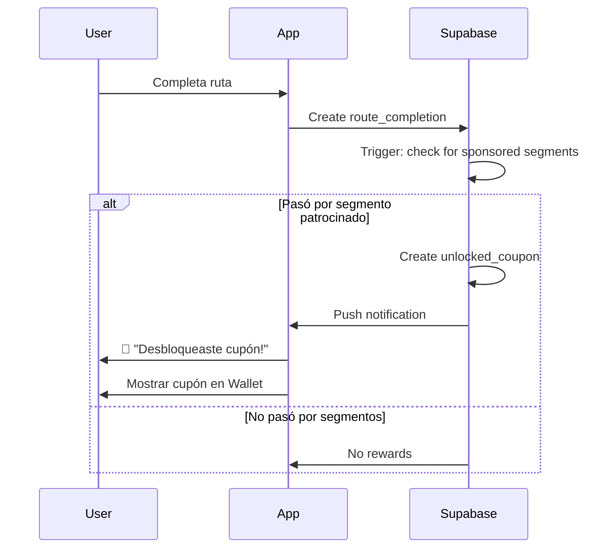

# 13 - Gamification & Coupon System

**Version:** 1.0
**Last Updated:** Enero 28, 2026
**Status:** 🟡 Infrastructure Ready, Feature Paused (Phase 2)

## OVERVIEW

Sistema de gamificación que incentiva completar rutas mediante **unlockable rewards** (cupones de descuento) y permite a businesses patrocinar segmentos específicos de rutas para aumentar visibilidad.

**Key Components:**
1. **Business Coupons**: Descuentos creados por comercios
2. **Unlocked Coupons**: Rewards desbloqueados por usuarios al completar rutas
3. **Sponsored Segments**: Segmentos de rutas patrocinados por businesses

**Current Status:**
- ✅ Database schema creado
- ✅ Tablas vacías (0 registros)
- ⏸️ Feature pausada para MVP
- 🎯 Target: Phase 2 (Q3 2026)

---

## 1. BUSINESS COUPONS

### 1.1 Overview

Descuentos digitales creados por businesses para atraer ciclistas. Se desbloquean al completar rutas específicas o segmentos patrocinados.

**Tipos de descuento:**
- **Porcentaje**: 10%, 15%, 20% off sobre total
- **Monto fijo**: $50 MXN, $100 MXN off

### 1.2 Database Schema

```sql
CREATE TABLE business_coupons (
    id UUID PRIMARY KEY,
    business_id UUID REFERENCES businesses(id),

    -- Coupon Details
    code TEXT NOT NULL,                -- "CICLISTA20"
    description TEXT,                  -- "20% off en bebidas"

    -- Discount Configuration
    discount_type TEXT CHECK (discount_type IN ('porcentaje', 'monto_fijo')),
    discount_value NUMERIC(8,2) NOT NULL,  -- 20.00 para 20% o $20 pesos
    minimum_purchase NUMERIC(8,2) DEFAULT 0,  -- Orden mínima $200

    -- Usage Limits
    max_uses INTEGER,                  -- NULL = unlimited
    current_uses INTEGER DEFAULT 0,

    -- Validity
    starts_at TIMESTAMPTZ DEFAULT NOW(),
    expires_at TIMESTAMPTZ,
    is_active BOOLEAN DEFAULT TRUE,

    created_at TIMESTAMPTZ DEFAULT NOW()
);
```

### 1.3 Example Coupons

| Business | Code | Discount | Min Purchase | Max Uses | Expires |
|----------|------|----------|--------------|----------|---------|
| Café Cenote | WELCOME10 | 10% off | $100 | 100 | 30 días |
| Taller BikeShop | REPAIR50 | $50 off | $200 | 50 | 60 días |
| Restaurant El Ciclista | MEAL20 | 20% off | $150 | Unlimited | 90 días |

### 1.4 Coupon Creation Flow (Business Dashboard)

```
┌────────────────────────────────────┐
│  Crear Nuevo Cupón                 │
├────────────────────────────────────┤
│  Código: [CICLISTA20___________]   │
│  Descripción:                      │
│  [20% de descuento en bebidas]     │
│                                    │
│  Tipo de descuento:                │
│  ○ Porcentaje  ● Monto fijo        │
│                                    │
│  Valor: [20] %                     │
│  Compra mínima: $[100] MXN         │
│  Usos máximos: [50] (opcional)     │
│                                    │
│  Fecha de expiración:              │
│  [30/04/2026___________________]   │
│                                    │
│  [Cancelar]  [Crear Cupón]         │
└────────────────────────────────────┘
```

---

## 2. UNLOCKED COUPONS

### 2.1 Overview

Instancias de cupones desbloqueados por usuarios al cumplir condiciones específicas. Cada usuario puede desbloquear el mismo coupon una sola vez.

**Unlock Reasons:**
- `ruta_completada`: Terminó una ruta completa
- `segmento_completado`: Pasó por un segmento patrocinado
- `primer_pedido`: Primera orden en un business
- `referido`: Invitó a un amigo que hizo su primera compra
- `promocion`: Cupón promocional manual (admin)

### 2.2 Database Schema

```sql
CREATE TABLE unlocked_coupons (
    id UUID PRIMARY KEY,
    user_id UUID REFERENCES profiles(id),
    coupon_id UUID REFERENCES business_coupons(id),

    -- Unlock Context
    unlock_reason TEXT CHECK (unlock_reason IN (
        'ruta_completada', 'segmento_completado', 'primer_pedido', 'referido', 'promocion'
    )),
    route_completion_id UUID REFERENCES route_completions(id),  -- si aplica

    -- Usage Tracking
    is_used BOOLEAN DEFAULT FALSE,
    used_at TIMESTAMPTZ,
    used_in_order_id UUID REFERENCES orders(id),

    -- Validity
    unlocked_at TIMESTAMPTZ DEFAULT NOW(),
    expires_at TIMESTAMPTZ,  -- Inherited from business_coupon or custom

    UNIQUE(user_id, coupon_id)  -- Un usuario solo puede desbloquear mismo cupón 1 vez
);
```

### 2.3 Unlock Flow



### 2.4 User Wallet - Coupons Section

```
┌─────────────────────────────────────┐
│  🎟️ Mis Cupones                     │
├─────────────────────────────────────┤
│                                     │
│  ✅ Disponibles (2)                 │
│  ───────────────────────────────    │
│  🏪 Café Cenote                     │
│  20% OFF en bebidas                 │
│  Código: CICLISTA20                 │
│  Expira: 15 Feb 2026                │
│  [Usar en Orden]                    │
│                                     │
│  🔧 Taller BikeShop                 │
│  $50 MXN OFF en reparación          │
│  Código: REPAIR50                   │
│  Expira: 28 Feb 2026                │
│  [Usar en Orden]                    │
│                                     │
│  ───────────────────────────────    │
│                                     │
│  🔒 Próximos a desbloquear          │
│  ───────────────────────────────    │
│  📍 Completa "Ruta Cenotes"         │
│     Desbloquea: 15% OFF Restaurant  │
│                                     │
│  📍 Completa segmento km 15-20      │
│     Desbloquea: Bebida gratis       │
│                                     │
└─────────────────────────────────────┘
```

---

## 3. SPONSORED SEGMENTS

### 3.1 Overview

**Concepto**: Businesses pagan para "patrocinar" un segmento específico de una ruta. Cuando ciclistas pasan por ese segmento, desbloquean un cupón del business patrocinador.

**Value Proposition:**
- **Para Businesses**: Publicidad nativa + tráfico dirigido (ciclistas hambrientos/sedientos cerca)
- **Para Ciclistas**: Rewards por completar rutas (gamificación)
- **Para Creadores**: Revenue adicional (compartir fee del sponsored segment)

### 3.2 Database Schema

```sql
CREATE TABLE sponsored_segments (
    id UUID PRIMARY KEY,
    business_id UUID REFERENCES businesses(id),
    route_id UUID REFERENCES routes(id),

    -- Segment Definition (waypoint indexes)
    segment_start_index INTEGER NOT NULL,  -- Waypoint #5
    segment_end_index INTEGER NOT NULL,    -- Waypoint #8
    segment_path GEOMETRY(LineString, 4326),  -- Extracted linestring

    -- Reward Configuration
    coupon_id UUID REFERENCES business_coupons(id),
    reward_message TEXT,  -- "¡Pasaste por Café Cenote! Cupón desbloqueado"

    -- Status
    is_active BOOLEAN DEFAULT TRUE,
    created_at TIMESTAMPTZ DEFAULT NOW(),
    expires_at TIMESTAMPTZ,  -- Campaign duration

    CHECK (segment_end_index > segment_start_index)
);

CREATE INDEX idx_sponsored_segments_route
ON sponsored_segments(route_id)
WHERE is_active = TRUE;
```

### 3.3 How It Works

**Example: Ruta "Cenotes de Cuzamá" (50km)**

```
Waypoints:
1. Inicio - Pueblo Cuzamá
2. Cenote Chelentún (km 8)
3. Cenote Chansinic'ché (km 12)
4. Mirador (km 18)
5. ⭐ SPONSORED START - Café Cenote (km 22)
6. ⭐ Tienda de artesanías (km 24)
7. ⭐ SPONSORED END - Restaurant Local (km 26)
8. Cenote Bolonchojool (km 35)
9. Fin - Pueblo Cuzamá
```

**Sponsored Segment:**
- Business: Café Cenote
- Segment: Waypoints #5-7 (km 22-26)
- Reward: Cupón "CICLISTA20" (20% off bebidas)
- Cost: $1,200 MXN/mes

**Detection Logic:**
```sql
-- Detectar si usuario pasó por segmento
CREATE FUNCTION check_sponsored_segment_completion(
    p_user_id UUID,
    p_route_id UUID,
    p_recorded_path GEOMETRY
) RETURNS VOID AS $$
DECLARE
    segment RECORD;
BEGIN
    -- Para cada segmento activo de esta ruta
    FOR segment IN
        SELECT * FROM sponsored_segments
        WHERE route_id = p_route_id AND is_active = TRUE
    LOOP
        -- Verificar si el path grabado intersecta el segmento
        IF ST_Intersects(p_recorded_path, segment.segment_path) THEN
            -- Desbloquear cupón
            INSERT INTO unlocked_coupons (
                user_id,
                coupon_id,
                unlock_reason,
                expires_at
            ) VALUES (
                p_user_id,
                segment.coupon_id,
                'segmento_completado',
                NOW() + INTERVAL '30 days'
            )
            ON CONFLICT (user_id, coupon_id) DO NOTHING;  -- Ya tenía el cupón
        END IF;
    END LOOP;
END;
$$ LANGUAGE plpgsql;
```

### 3.4 Pricing Model (Phase 2)

**Sponsored Segment Pricing:**

| Route Traffic | Price/Month | Estimated Impressions |
|---------------|-------------|----------------------|
| <10 completions/mes | $500 MXN | <10 unlocks |
| 10-50 completions | $1,000 MXN | 10-50 unlocks |
| 50-100 completions | $1,500 MXN | 50-100 unlocks |
| >100 completions | Custom pricing | >100 unlocks |

**Revenue Split:**
- Business paga: $1,200 MXN/mes
- Route Creator recibe: $360 MXN (30%)
- Platform retiene: $840 MXN (70%)

**Justificación:**
- Creator merece share porque su ruta genera el tráfico
- Platform hace heavy lifting (tech, moderation, billing)

---

## 4. GAMIFICATION MECHANICS

### 4.1 Achievement System

**Badges para incentivar uso:**

| Badge | Condition | Reward |
|-------|-----------|--------|
| 🚴 First Ride | Completar primera ruta | Cupón $20 off en cualquier business |
| 🔥 Streak Master | 7 días consecutivos ciclando | 15% off cupón premium |
| 🏆 Century Rider | Acumular 100km en un mes | Ruta premium gratis |
| 🎯 Explorer | Completar 10 rutas diferentes | Badge público + cupón |
| 💎 Premium Member | Comprar 3 rutas premium | Descuento en membership |

### 4.2 Points System (Future)

**Earn points for:**
- Completar ruta: 10 points
- Primera review: 5 points
- Subir foto en waypoint: 2 points
- Invitar amigo: 50 points (cuando hace primera compra)

**Redeem points:**
- 100 points = $10 MXN wallet credit
- 500 points = 1 ruta premium gratis
- 1000 points = 20% off en todas las órdenes por 1 mes

### 4.3 Leaderboards

**Monthly Route Leaderboards:**
```
┌─────────────────────────────────────┐
│  🏆 Top Ciclistas - Enero 2026      │
├─────────────────────────────────────┤
│  1. 👤 Carlos M.    485 km  🏅      │
│  2. 👤 Ana G.       421 km          │
│  3. 👤 Luis R.      389 km          │
│  ─────────────────────────────────  │
│  15. 👤 Tú          156 km          │
│                                     │
│  [Ver Top 100]                      │
└─────────────────────────────────────┘
```

**Categories:**
- Total distance this month
- Most routes completed
- Most reviews written
- Fastest time on popular routes

---

## 5. BUSINESS BENEFITS

### 5.1 Why Businesses Should Create Coupons

**Immediate Benefits:**
- **Foot traffic increase**: Ciclistas motivados a detenerse
- **Brand awareness**: Presencia en app de cycling específica
- **Inventory optimization**: Pre-orden permite planear stock
- **Data insights**: Ver cuántos ciclistas pasan cerca

**Long-term Benefits:**
- **Customer loyalty**: Usuarios que usan cupón → más likely to return
- **Word of mouth**: Cyclists share good stops con su comunidad
- **Premium placement**: Appear en route detail pages

### 5.2 Coupon ROI Calculation

**Example: Café Cenote**

**Investment:**
- Coupon: 20% off (cost: $20 avg per redemption)
- Sponsored segment: $1,200 MXN/mes
- Total: ~$1,400 MXN/mes

**Returns (conservative estimate):**
- 50 ciclistas pasan por segmento/mes
- 30% redemption rate = 15 redemptions
- Avg order: $150 MXN
- Revenue from coupons: 15 × $150 = $2,250 MXN
- Discount given: 15 × $30 = $450 MXN
- Net new revenue: $2,250 - $450 = $1,800 MXN

**ROI:** ($1,800 - $1,400) / $1,400 = **28% monthly ROI**

Plus intangibles:
- Future visits (lifetime value)
- Word of mouth marketing
- Brand positioning as "cyclist-friendly"

---

## 6. IMPLEMENTATION ROADMAP

### 6.1 Phase 1 (MVP) - Status: ⏸️ PAUSED

**What's Ready:**
- ✅ Database tables created
- ✅ RLS policies defined
- ✅ Schema documented

**Why Paused:**
- Focus on core route sales + orders first
- Need critical mass of routes/businesses before gamification adds value
- Avoid feature overload for MVP

### 6.2 Phase 2 (Q3 2026) - Target Launch

**Prerequisites:**
- ≥20 active routes
- ≥10 active businesses
- ≥100 MAU (monthly active users)
- Route completion tracking stable

**Launch Plan:**
1. **Week 1-2**: Business outreach
   - Onboard 3 pilot businesses
   - Create sponsored segments on popular routes
   - Set up initial coupons

2. **Week 3-4**: Soft launch
   - Enable coupon unlock for beta users
   - Test detection logic with real GPS data
   - Monitor unlock/redemption rates

3. **Week 5-6**: Public launch
   - Announce feature via push notification
   - Marketing campaign: "Pedal & Earn"
   - Measure engagement metrics

**Success Metrics:**
- ≥20% of route completions unlock coupons
- ≥15% coupon redemption rate
- ≥5 businesses sign up for sponsored segments
- ≥$5,000 MXN/mes en sponsored segment revenue

### 6.3 Phase 3 (Future Enhancements)

**Advanced Features:**
- **Dynamic segment pricing**: Based on route popularity
- **Coupon marketplace**: Users can trade/gift unused coupons
- **Challenge campaigns**: "Complete 5 cenote routes this month → special reward"
- **Business analytics dashboard**: See segment performance, ROI tracking
- **Geo-fencing**: Auto-apply coupon when user arrives at business location

---

## 7. TECHNICAL CONSIDERATIONS

### 7.1 GPS Accuracy Challenges

**Problem:** GPS drift puede causar false positives/negatives

**Solutions:**
- **Buffer zone**: Segment intersection requires 80% overlap (not 100%)
- **Speed validation**: Ignore data points where speed >50 km/h (likely in vehicle)
- **Path smoothing**: Apply Kalman filter to recorded GPS track
- **Manual verification**: Allow users to report "didn't unlock" → admin review

### 7.2 Offline Support

**Challenge:** User completes route offline, syncs later

**Approach:**
1. Store `route_completion` locally with GPS track
2. Upload when internet available
3. Run segment detection server-side
4. Push notification: "You unlocked 2 coupons!"

### 7.3 Fraud Prevention

**Scenario 1: GPS Spoofing**
- Detection: Check for impossible speeds (teleporting)
- Mitigation: Require continuous GPS trail, not just start/end points

**Scenario 2: Coupon Sharing**
- Problem: User screenshots coupon code, shares con amigos
- Mitigation: Coupons tied to user ID, verified at checkout (order must be by same user)

**Scenario 3: Driving Through Segments**
- Detection: Speed >30 km/h average → invalid
- Mitigation: Require activity type = "cycling" (from sensors/manual select)

---

## 8. USER STORIES

### 8.1 Cyclist Perspective

**María, Ciclista Local:**
```
Domingo 10:00 AM - Abre app Kaelo
"Quiero hacer la Ruta Cenotes hoy"

🎯 Ve badge: "Completa esta ruta y desbloquea 15% OFF en Café Cenote"

Durante la ruta:
- Km 22: Pasa por Café Cenote
- App detecta ubicación
- 🎉 Push: "¡Cupón desbloqueado! 15% OFF esperándote"

Al finalizar:
- Va a sección Wallet
- Ve cupón activo
- Hace pre-orden de snack + bebida
- Aplica cupón en checkout
- Ahorra $30 MXN

Resultado: "¡Me encanta que me premien por ciclear!"
```

### 8.2 Business Owner Perspective

**Roberto, Dueño de Café Cenote:**
```
Lunes - Registra business en Kaelo
Martes - Crea cupón "CICLISTA15" (15% off)
Miércoles - Paga $1,200 para sponsor segmento en "Ruta Cenotes"

Fin de mes:
- 45 ciclistas pasaron por su segmento
- 18 usaron el cupón (40% redemption!)
- Revenue nuevo: $2,700 MXN
- Costo (sponsored + descuentos): $1,750 MXN
- Profit: $950 MXN

Plus: 5 ciclistas preguntaron por "la oferta de Kaelo"
     → Brand awareness aumentando

Decisión: "Renovar sponsorship por 3 meses más"
```

---

## 9. INTEGRATION WITH OTHER SYSTEMS

### 9.1 Route Purchases

**Synergy:** Premium routes pueden tener sponsored segments exclusivos

**Example:**
- Ruta premium "Hidden Cenotes" ($120 MXN)
- Incluye sponsored segment: "Restaurante Secreto"
- Cupón exclusivo: 25% off (solo para compradores)
- Value-add justifica el precio premium

### 9.2 Notifications

**Triggered notifications:**
```javascript
// When coupon unlocked
{
  title: "🎉 ¡Nuevo cupón desbloqueado!",
  body: "15% OFF en Café Cenote esperándote",
  data: {
    type: "coupon_unlocked",
    coupon_id: "uuid",
    business_id: "uuid"
  },
  action: "Abrir Wallet"
}

// When coupon about to expire
{
  title: "⏰ Tu cupón expira pronto",
  body: "Usa 20% OFF en BikeShop antes del 28 Feb",
  data: {
    type: "coupon_expiring",
    coupon_id: "uuid",
    expires_at: "2026-02-28"
  }
}
```

### 9.3 Reviews

**Incentive:** Unlock bonus coupon after writing review

**Flow:**
1. User completes route
2. Reviews route (5 stars + comment)
3. Unlocks special "Reviewer" coupon
4. Encourages quality reviews

---

## 10. COMPETITIVE ANALYSIS

### 10.1 Similar Systems

**Strava Challenges:**
- Sponsor-branded challenges (e.g., "Ride 100km with Specialized")
- Rewards: Digital badges, raffle entries
- Weakness: No direct local business integration

**Komoot Pioneer System:**
- Users discover new routes → earn "pioneer" status
- Rewards: Purely recognition-based
- Weakness: No monetary incentive

**Kaelo Advantage:**
- **Local focus**: Directly connects con businesses en la ruta
- **Immediate rewards**: Cupones usables el mismo día
- **Two-sided value**: Users ganan descuentos, businesses ganan clientes

---

**Related Documents:**
- [01 - Project Overview](./01-project-overview.md)
- [02 - Requirements](./02-requirements.md)
- [12 - Monetization System](./12-monetization-system.md)
