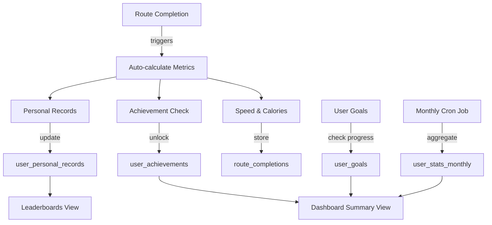
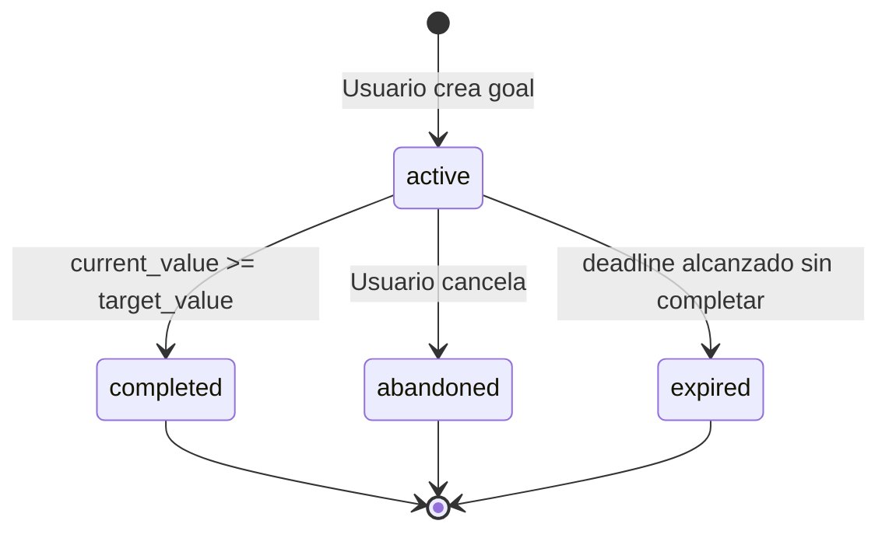

# 14 - User Metrics System

**Version:** 1.0
**Last Updated:** Enero 2026
**Migration:** `20260128200001_add_user_metrics_system.sql`

## Tabla de Contenidos

1. [Descripción General](#1-descripción-general)
2. [Sistema de Métricas de Rendimiento](#2-sistema-de-métricas-de-rendimiento)
3. [Sistema de Logros (Achievements)](#3-sistema-de-logros-achievements)
4. [Sistema de Objetivos Personales](#4-sistema-de-objetivos-personales)
5. [Récords Personales](#5-récords-personales)
6. [Estadísticas Mensuales Agregadas](#6-estadísticas-mensuales-agregadas)
7. [Algoritmos de Cálculo](#7-algoritmos-de-cálculo)
8. [Sistema de Recomendaciones](#8-sistema-de-recomendaciones)
9. [Comparaciones y Leaderboards](#9-comparaciones-y-leaderboards)
10. [Dashboard UI Mockups](#10-dashboard-ui-mockups)
11. [API Reference](#11-api-reference)

---

## 1. Descripción General

### 1.1 Propósito

El **User Metrics System** es un sistema completo de tracking y gamificación que proporciona:

- Métricas detalladas de rendimiento en cada ruta (velocidad, calorías, elevación)
- Sistema de logros desbloqueables para engagement
- Objetivos personales configurables por el usuario
- Récords personales y comparaciones con otros ciclistas
- Estadísticas agregadas mensuales para insights de largo plazo
- Recomendaciones personalizadas basadas en historial

### 1.2 Arquitectura del Sistema



### 1.3 Tablas del Sistema

| Tabla | Propósito | Filas Estimadas |
|-------|-----------|-----------------|
| `route_completions` (extended) | Métricas detalladas por ride | ~50k/año |
| `user_achievements` | Logros desbloqueados | ~20/usuario |
| `user_goals` | Objetivos activos/completados | ~5 activos/usuario |
| `user_personal_records` | Mejores tiempos por ruta | ~2-4 por ruta |
| `user_stats_monthly` | Agregados mensuales | 12/año/usuario |

---

## 2. Sistema de Métricas de Rendimiento

### 2.1 Extensión de `route_completions`

Se agregaron **7 nuevas columnas** para tracking avanzado:

```sql
-- Performance metrics
distance_actual_km NUMERIC(6,2)       -- GPS-tracked actual distance
avg_speed_kmh NUMERIC(4,1)            -- Average speed (auto-calculated)
max_speed_kmh NUMERIC(4,1)            -- Max speed reached
calories_burned INTEGER               -- Estimated calories (MET formula)
elevation_gain_actual_m INTEGER       -- Actual elevation from GPS

-- Context data
weather_conditions JSONB              -- Weather at completion time
device_info JSONB                     -- Device used for tracking
```

### 2.2 Estructura de Datos JSONB

#### `weather_conditions`

```json
{
  "temp_celsius": 28,
  "wind_speed_kmh": 12,
  "humidity_percent": 65,
  "conditions": "partly_cloudy",
  "source": "openweathermap"
}
```

**Conditions enum:**
- `clear` - Despejado
- `partly_cloudy` - Parcialmente nublado
- `cloudy` - Nublado
- `rain` - Lluvia
- `heavy_rain` - Lluvia intensa
- `storm` - Tormenta

#### `device_info`

```json
{
  "brand": "Samsung",
  "model": "Galaxy S23",
  "os_version": "Android 14",
  "app_version": "1.2.0",
  "gps_accuracy_meters": 5.2,
  "gps_provider": "fused"
}
```

### 2.3 Triggers Automáticos

#### Auto-cálculo de Velocidad Promedio

```sql
-- Triggered on INSERT/UPDATE
-- Formula: avg_speed = distance_km / (duration_min / 60)
avg_speed_kmh := ROUND(
    (distance_actual_km / (total_duration / 60.0))::NUMERIC,
    1
);
```

#### Auto-cálculo de Calorías

```sql
-- MET-based formula
-- Triggered on completion
calories = MET × weight_kg × duration_hours
```

**Tabla de MET values por velocidad:**

| Velocidad (km/h) | MET Value | Nivel de Esfuerzo |
|------------------|-----------|-------------------|
| < 20 | 6.0 | Ligero (paseo recreativo) |
| 20 - 25 | 8.0 | Moderado (ciclismo general) |
| 25 - 30 | 10.0 | Vigoroso (entrenamiento) |
| > 30 | 12.0 | Racing (competencia) |

**Ejemplo de cálculo:**

```javascript
// User: 70kg, Duration: 90 min (1.5 hours), Avg Speed: 24 km/h
const met = 8.0; // Moderado
const calories = 8.0 * 70 * 1.5 = 840 calories
```

---

## 3. Sistema de Logros (Achievements)

### 3.1 Tipos de Achievements

**19 tipos de logros** organizados en 6 categorías:

#### Categoría: Primeros Pasos
| Achievement | Condición | Puntos |
|-------------|-----------|--------|
| `first_ride` | Completar primera ruta | 50 |

#### Categoría: Distancia
| Achievement | Condición | Puntos |
|-------------|-----------|--------|
| `distance_10km` | Completar 10km en un ride | 30 |
| `distance_50km` | Completar 50km en un ride | 100 |
| `distance_100km_total` | Acumular 100km totales | 100 |
| `distance_500km_total` | Acumular 500km totales | 250 |
| `distance_1000km_total` | Acumular 1000km totales | 500 |

#### Categoría: Velocidad
| Achievement | Condición | Puntos |
|-------------|-----------|--------|
| `speed_demon` | Promedio 40+ km/h | 200 |

#### Categoría: Consistencia
| Achievement | Condición | Puntos |
|-------------|-----------|--------|
| `routes_completed_10` | Completar 10 rutas diferentes | 150 |
| `routes_completed_50` | Completar 50 rutas diferentes | 400 |
| `streak_7_days` | Montar 7 días consecutivos | 100 |
| `streak_30_days` | Montar 30 días consecutivos | 300 |

#### Categoría: Horarios Especiales
| Achievement | Condición | Puntos |
|-------------|-----------|--------|
| `early_bird` | Completar antes de 7am | 50 |
| `night_rider` | Completar después de 8pm | 50 |

#### Categoría: Exploración
| Achievement | Condición | Puntos |
|-------------|-----------|--------|
| `explorer` | Visitar 20 waypoints diferentes | 75 |
| `cenote_hunter` | Visitar 10 cenotes | 150 |
| `elevation_master` | Acumular 1000m de elevación | 200 |

#### Categoría: Comunidad
| Achievement | Condición | Puntos |
|-------------|-----------|--------|
| `supporter` | Comprar 5 rutas premium | 200 |
| `socialite` | Dejar 10 reseñas | 100 |
| `route_creator` | Crear y publicar primera ruta | 150 |
| `all_weather` | Montar en 3+ condiciones climáticas | 100 |

### 3.2 Estructura de Achievement

```sql
CREATE TABLE user_achievements (
    id UUID PRIMARY KEY,
    user_id UUID REFERENCES profiles(id),
    achievement_type TEXT NOT NULL,

    -- Progress tracking
    progress_current INTEGER DEFAULT 0,
    progress_target INTEGER NOT NULL,
    is_unlocked BOOLEAN DEFAULT FALSE,

    -- Rewards
    points_awarded INTEGER DEFAULT 0,
    badge_icon TEXT, -- URL to badge PNG

    -- Metadata
    metadata JSONB DEFAULT '{}',
    unlocked_at TIMESTAMPTZ
);
```

### 3.3 Ejemplo de Metadata

```json
{
  "value": 42.5,
  "route_id": "550e8400-e29b-41d4-a716-446655440000",
  "route_name": "Ruta de los Cenotes",
  "details": "Reached 42.5 km/h average on Ruta de los Cenotes",
  "weather": "sunny",
  "special_notes": "Personal best!"
}
```

### 3.4 Auto-unlock Logic

El trigger `check_achievements_on_completion` evalúa automáticamente:

1. **On first completion:** Desbloquea `first_ride`
2. **On every completion:** Evalúa progreso de distancia, velocidad, streaks
3. **Upsert pattern:** Si ya existe, actualiza `progress_current`

```sql
-- Example: Distance milestone check
IF total_distance >= 100 THEN
    INSERT INTO user_achievements (...)
    VALUES (user_id, 'distance_100km_total', total_distance, 100, TRUE, NOW(), 100, ...)
    ON CONFLICT (user_id, achievement_type)
    DO UPDATE SET
        progress_current = total_distance,
        is_unlocked = TRUE,
        unlocked_at = COALESCE(user_achievements.unlocked_at, NOW());
END IF;
```

---

## 4. Sistema de Objetivos Personales

### 4.1 Tipos de Goals

**7 tipos de objetivos configurables:**

| Goal Type | Descripción | Unidad |
|-----------|-------------|--------|
| `distance_monthly` | Distancia mensual | km |
| `distance_weekly` | Distancia semanal | km |
| `routes_count` | Número de rutas a completar | routes |
| `streak_days` | Mantener X días de streak | days |
| `avg_speed` | Alcanzar velocidad promedio | km/h |
| `elevation_total` | Acumular elevación total | meters |
| `calories` | Quemar X calorías | calories |
| `custom` | Objetivo personalizado | other |

### 4.2 Estructura de Goal

```sql
CREATE TABLE user_goals (
    id UUID PRIMARY KEY,
    user_id UUID REFERENCES profiles(id),
    goal_type TEXT NOT NULL,

    title TEXT NOT NULL,
    description TEXT,

    -- Progress
    target_value NUMERIC(10,2) NOT NULL,
    current_value NUMERIC(10,2) DEFAULT 0,
    unit TEXT NOT NULL, -- km, routes, days, etc.

    -- Status
    status TEXT DEFAULT 'active', -- active, completed, abandoned, expired
    deadline TIMESTAMPTZ,

    -- Rewards
    reward_points INTEGER DEFAULT 0
);
```

### 4.3 Ejemplo: Goal de 200km Mensuales

```json
{
  "goal_type": "distance_monthly",
  "title": "200km en Enero",
  "description": "Recorrer 200 kilómetros durante el mes de enero para mantener mi condición física",
  "target_value": 200.00,
  "current_value": 87.50,
  "unit": "km",
  "status": "active",
  "deadline": "2026-01-31T23:59:59Z",
  "reward_points": 150
}
```

### 4.4 Estado del Goal



### 4.5 Auto-update de Progreso

**Frontend responsibility:**
Después de cada route completion, el app debe actualizar los goals activos:

```typescript
// Example: Update distance_monthly goal
await supabase
  .from('user_goals')
  .update({
    current_value: sql`current_value + ${newDistance}`,
    status: sql`CASE WHEN current_value + ${newDistance} >= target_value THEN 'completed' ELSE 'active' END`,
    completed_at: sql`CASE WHEN current_value + ${newDistance} >= target_value THEN NOW() ELSE NULL END`
  })
  .eq('user_id', userId)
  .eq('goal_type', 'distance_monthly')
  .eq('status', 'active');
```

---

## 5. Récords Personales

### 5.1 Tipos de Records

**4 tipos de récords por usuario-ruta:**

| Record Type | Descripción | Métrica |
|-------------|-------------|---------|
| `fastest_time` | Mejor tiempo de completación | minutes |
| `highest_avg_speed` | Mejor velocidad promedio | km/h |
| `lowest_time` | Menor duración (alias de fastest_time) | minutes |
| `most_distance` | Mayor distancia (variante de ruta) | km |

### 5.2 Estructura de Personal Record

```sql
CREATE TABLE user_personal_records (
    id UUID PRIMARY KEY,
    user_id UUID REFERENCES profiles(id),
    route_id UUID REFERENCES routes(id),
    completion_id UUID REFERENCES route_completions(id),
    record_type TEXT NOT NULL,

    -- Metrics
    best_time_min INTEGER,
    best_avg_speed_kmh NUMERIC(4,1),
    best_distance_km NUMERIC(6,2),

    -- Improvement tracking
    previous_record_id UUID REFERENCES user_personal_records(id),
    improvement_percentage NUMERIC(5,2),

    achieved_at TIMESTAMPTZ NOT NULL,

    UNIQUE(user_id, route_id, record_type)
);
```

### 5.3 Auto-update Logic

El trigger `update_personal_records()` se ejecuta después de cada completion:

**Algoritmo para `fastest_time`:**

```sql
1. SELECT current_fastest_time FROM user_personal_records
   WHERE user_id = X AND route_id = Y AND record_type = 'fastest_time'

2. IF new_time < current_fastest_time (or no record exists):
   a. Calculate improvement_percentage
   b. INSERT or UPDATE record
   c. Set previous_record_id to old record
```

**Ejemplo de mejora:**

```javascript
// Previous record: 120 minutes
// New record: 105 minutes
improvement = ((120 - 105) / 120) * 100 = 12.5%

// Result stored in DB:
{
  "best_time_min": 105,
  "previous_record_id": "uuid-of-120min-record",
  "improvement_percentage": 12.5,
  "achieved_at": "2026-01-28T15:30:00Z"
}
```

### 5.4 Comparaciones: Tu Mejor vs Ahora

**Query para comparar último ride con PR:**

```sql
WITH last_completion AS (
  SELECT
    total_duration,
    avg_speed_kmh,
    distance_actual_km
  FROM route_completions
  WHERE user_id = $1 AND route_id = $2
  ORDER BY completed_at DESC
  LIMIT 1
),
personal_best AS (
  SELECT
    best_time_min,
    best_avg_speed_kmh
  FROM user_personal_records
  WHERE user_id = $1 AND route_id = $2
)
SELECT
  lc.total_duration AS current_time,
  pb.best_time_min AS best_time,
  (lc.total_duration - pb.best_time_min) AS time_diff_min,
  lc.avg_speed_kmh AS current_speed,
  pb.best_avg_speed_kmh AS best_speed,
  (lc.avg_speed_kmh - pb.best_avg_speed_kmh) AS speed_diff_kmh
FROM last_completion lc
CROSS JOIN personal_best pb;
```

**Ejemplo de resultado:**

```json
{
  "current_time": 115,
  "best_time": 105,
  "time_diff_min": 10,  // 10 min slower
  "current_speed": 22.5,
  "best_speed": 24.8,
  "speed_diff_kmh": -2.3  // 2.3 km/h slower
}
```

---

## 6. Estadísticas Mensuales Agregadas

### 6.1 Propósito

Pre-agregar estadísticas mensuales para:
- Mejorar performance de dashboard (evitar scans de route_completions)
- Comparaciones mes-a-mes rápidas
- Insights de tendencias de largo plazo

### 6.2 Estructura de Monthly Stats

```sql
CREATE TABLE user_stats_monthly (
    id UUID PRIMARY KEY,
    user_id UUID REFERENCES profiles(id),
    year INTEGER NOT NULL,
    month INTEGER NOT NULL,

    -- Ride metrics
    total_distance_km NUMERIC(10,2) DEFAULT 0,
    total_rides INTEGER DEFAULT 0,
    total_duration_min INTEGER DEFAULT 0,
    total_elevation_gain_m INTEGER DEFAULT 0,

    -- Performance
    avg_speed_kmh NUMERIC(4,1),
    max_speed_kmh NUMERIC(4,1),
    avg_distance_per_ride_km NUMERIC(6,2),

    -- Health
    total_calories_burned INTEGER DEFAULT 0,

    -- Engagement
    routes_completed INTEGER DEFAULT 0,
    unique_routes_completed INTEGER DEFAULT 0,
    waypoints_visited INTEGER DEFAULT 0,
    businesses_visited INTEGER DEFAULT 0,

    -- Favorites
    favorite_route_id UUID REFERENCES routes(id),
    favorite_route_rides INTEGER DEFAULT 0,

    -- Gamification
    achievements_unlocked INTEGER DEFAULT 0,
    total_points_earned INTEGER DEFAULT 0,

    -- Comparisons (vs previous month)
    distance_change_percent NUMERIC(5,2),
    rides_change_percent NUMERIC(5,2),
    speed_change_percent NUMERIC(5,2),

    calculated_at TIMESTAMPTZ NOT NULL DEFAULT NOW(),
    UNIQUE(user_id, year, month)
);
```

### 6.3 Agregación Automática

**Cron Job:** Ejecutar `aggregate_monthly_stats()` al final de cada mes

```sql
-- Run via pg_cron or Supabase Edge Function
SELECT aggregate_monthly_stats(2026, 1); -- Aggregate January 2026
```

**Algoritmo de agregación:**

```sql
FOR each user with completions in target month:
    1. SUM(distance_actual_km) → total_distance_km
    2. COUNT(*) → total_rides
    3. SUM(total_duration) → total_duration_min
    4. AVG(avg_speed_kmh) → avg_speed_kmh
    5. MAX(max_speed_kmh) → max_speed_kmh
    6. SUM(calories_burned) → total_calories_burned
    7. COUNT(DISTINCT route_id) → unique_routes_completed
    8. COUNT(achievements unlocked in month) → achievements_unlocked
    9. Find most ridden route → favorite_route_id
    10. Calculate % change vs previous month → distance_change_percent
```

### 6.4 Comparación Mes a Mes

**Query para comparar últimos 3 meses:**

```sql
SELECT
  year,
  month,
  total_distance_km,
  total_rides,
  avg_speed_kmh,
  distance_change_percent,
  rides_change_percent
FROM user_stats_monthly
WHERE user_id = $1
ORDER BY year DESC, month DESC
LIMIT 3;
```

**Resultado ejemplo:**

```json
[
  {
    "year": 2026,
    "month": 3,
    "total_distance_km": 245.50,
    "total_rides": 12,
    "avg_speed_kmh": 23.8,
    "distance_change_percent": 15.2,  // +15.2% vs Feb
    "rides_change_percent": 9.1       // +9.1% vs Feb
  },
  {
    "year": 2026,
    "month": 2,
    "total_distance_km": 213.00,
    "total_rides": 11,
    "avg_speed_kmh": 22.5,
    "distance_change_percent": -5.8,  // -5.8% vs Jan
    "rides_change_percent": 0.0
  },
  {
    "year": 2026,
    "month": 1,
    "total_distance_km": 226.50,
    "total_rides": 11,
    "avg_speed_kmh": 21.9,
    "distance_change_percent": null,
    "rides_change_percent": null
  }
]
```

---

## 7. Algoritmos de Cálculo

### 7.1 Fórmula de Calorías (MET Method)

**Metabolic Equivalent of Task (MET)**

```
Calorías = MET × Peso (kg) × Duración (horas)
```

**Tabla de METs para ciclismo:**

| Actividad | MET | Velocidad (km/h) |
|-----------|-----|------------------|
| Cycling, leisure, slow | 6.0 | < 16 |
| Cycling, leisure, moderate | 8.0 | 16 - 19 |
| Cycling, general | 8.0 | 19 - 22.5 |
| Cycling, moderate effort | 10.0 | 22.5 - 25.5 |
| Cycling, vigorous effort | 12.0 | 25.5 - 30 |
| Cycling, racing | 15.8 | > 32 |

**Implementación en trigger:**

```sql
-- Determine MET based on speed
IF avg_speed_kmh < 20 THEN
    met_value := 6.0;
ELSIF avg_speed_kmh < 25 THEN
    met_value := 8.0;
ELSIF avg_speed_kmh < 30 THEN
    met_value := 10.0;
ELSE
    met_value := 12.0;
END IF;

-- Get user weight (default 70kg)
SELECT COALESCE((preferences->>'weight_kg')::NUMERIC, 70)
INTO user_weight_kg
FROM profiles WHERE id = user_id;

-- Calculate
duration_hours := total_duration / 60.0;
calories := ROUND(met_value * user_weight_kg * duration_hours);
```

**Ejemplo de cálculo completo:**

```javascript
// User profile
const user = {
  weight_kg: 75,
  preferences: { weight_kg: 75 }
};

// Ride data
const ride = {
  avg_speed_kmh: 24,
  total_duration: 90 // minutes
};

// Calculation
const met = 8.0; // 24 km/h = moderate effort
const duration_hours = 90 / 60; // 1.5 hours
const calories = met * 75 * 1.5;
// Result: 8.0 * 75 * 1.5 = 900 calories
```

### 7.2 Cálculo de Velocidad Promedio

**Fórmula básica:**

```
avg_speed (km/h) = distance (km) / time (hours)
```

**Implementación:**

```sql
avg_speed_kmh := ROUND(
    (distance_actual_km / (total_duration / 60.0))::NUMERIC,
    1
);
```

**Ejemplo:**

```javascript
// Ride: 35km in 85 minutes
const distance_km = 35;
const duration_min = 85;
const avg_speed = distance_km / (duration_min / 60);
// Result: 35 / 1.417 = 24.7 km/h
```

### 7.3 Cálculo de Elevación Acumulada

**Método: GPS point-by-point difference**

```javascript
function calculateElevationGain(gpsPoints) {
  let totalGain = 0;

  for (let i = 1; i < gpsPoints.length; i++) {
    const elevDiff = gpsPoints[i].altitude - gpsPoints[i-1].altitude;

    // Only count positive differences (climbing)
    if (elevDiff > 0) {
      totalGain += elevDiff;
    }
  }

  return Math.round(totalGain);
}

// Example
const points = [
  { lat: 20.97, lng: -89.62, altitude: 10 },
  { lat: 20.98, lng: -89.63, altitude: 15 }, // +5m
  { lat: 20.99, lng: -89.64, altitude: 12 }, // -3m (ignored)
  { lat: 21.00, lng: -89.65, altitude: 18 }, // +6m
];

// Total gain = 5 + 6 = 11 meters
```

### 7.4 Cálculo de Distancia Real (Haversine)

**Fórmula de Haversine para distancia entre dos puntos GPS:**

```javascript
function haversineDistance(lat1, lon1, lat2, lon2) {
  const R = 6371; // Earth radius in km
  const dLat = toRad(lat2 - lat1);
  const dLon = toRad(lon2 - lon1);

  const a = Math.sin(dLat/2) * Math.sin(dLat/2) +
            Math.cos(toRad(lat1)) * Math.cos(toRad(lat2)) *
            Math.sin(dLon/2) * Math.sin(dLon/2);

  const c = 2 * Math.atan2(Math.sqrt(a), Math.sqrt(1-a));
  return R * c; // Distance in km
}

function totalDistance(gpsPoints) {
  let total = 0;
  for (let i = 1; i < gpsPoints.length; i++) {
    total += haversineDistance(
      gpsPoints[i-1].lat,
      gpsPoints[i-1].lng,
      gpsPoints[i].lat,
      gpsPoints[i].lng
    );
  }
  return total;
}
```

**O usar PostGIS:**

```sql
SELECT ST_Length(
  ST_Transform(actual_path, 3857) -- Transform to meters
) / 1000 AS distance_km
FROM route_completions
WHERE id = $1;
```

### 7.5 Cálculo de Percentage Improvement

**Fórmula:**

```
improvement_% = ((old_value - new_value) / old_value) * 100
```

**Para tiempo (menor es mejor):**

```javascript
// Old time: 120 min, New time: 105 min
const improvement = ((120 - 105) / 120) * 100;
// Result: 12.5% improvement
```

**Para velocidad (mayor es mejor):**

```javascript
// Old speed: 22 km/h, New speed: 24 km/h
const improvement = ((24 - 22) / 22) * 100;
// Result: 9.09% improvement
```

---

## 8. Sistema de Recomendaciones

### 8.1 Algoritmo de Recomendación de Rutas

**Objetivo:** Sugerir rutas personalizadas basadas en:
1. Nivel de habilidad del usuario (velocidad promedio)
2. Distancias preferidas (historial)
3. Rutas similares a las que le gustaron (reviews)
4. Nuevas rutas para evitar monotonía

**Query de recomendación:**

```sql
WITH user_profile AS (
  -- Get user's average metrics
  SELECT
    AVG(avg_speed_kmh) AS avg_speed,
    AVG(distance_actual_km) AS avg_distance,
    ARRAY_AGG(DISTINCT route_id) AS completed_routes,
    COUNT(*) AS total_rides
  FROM route_completions
  WHERE user_id = $1 AND status = 'completed'
),
user_preferred_tags AS (
  -- Get tags from highly rated routes
  SELECT DISTINCT jsonb_array_elements_text(r.tags) AS tag
  FROM routes r
  JOIN reviews rv ON r.id = rv.route_id
  WHERE rv.user_id = $1 AND rv.rating >= 4
)
SELECT
  r.id,
  r.name,
  r.slug,
  r.distance_km,
  r.difficulty,
  r.average_rating,
  r.cover_image_url,

  -- Recommendation score (0-100)
  (
    -- Distance match (30 points max)
    CASE
      WHEN ABS(r.distance_km - up.avg_distance) < 5 THEN 30
      WHEN ABS(r.distance_km - up.avg_distance) < 10 THEN 20
      WHEN ABS(r.distance_km - up.avg_distance) < 20 THEN 10
      ELSE 0
    END +

    -- Difficulty match based on user speed (30 points max)
    CASE
      WHEN up.avg_speed < 20 AND r.difficulty = 'facil' THEN 30
      WHEN up.avg_speed BETWEEN 20 AND 25 AND r.difficulty = 'moderada' THEN 30
      WHEN up.avg_speed > 25 AND r.difficulty IN ('dificil', 'experto') THEN 30
      ELSE 10
    END +

    -- Rating (20 points max)
    (r.average_rating * 4)::INTEGER +

    -- Tag match (20 points max)
    (
      SELECT COUNT(*) * 5
      FROM user_preferred_tags upt
      WHERE r.tags @> jsonb_build_array(upt.tag)
      LIMIT 4
    )
  ) AS recommendation_score,

  -- Reason for recommendation
  CASE
    WHEN r.id = ANY(up.completed_routes) THEN 'Ride it again!'
    WHEN (SELECT COUNT(*) FROM user_preferred_tags WHERE r.tags @> jsonb_build_array(tag)) > 0 THEN 'Based on your interests'
    WHEN ABS(r.distance_km - up.avg_distance) < 5 THEN 'Perfect distance for you'
    ELSE 'New adventure'
  END AS recommendation_reason

FROM routes r
CROSS JOIN user_profile up
WHERE r.status = 'publicado'
  AND r.id != ALL(up.completed_routes) -- Exclude already completed (optional)
ORDER BY recommendation_score DESC, r.average_rating DESC
LIMIT 10;
```

**Resultado ejemplo:**

```json
[
  {
    "id": "uuid-1",
    "name": "Ruta de los Cenotes Premium",
    "distance_km": 45.5,
    "difficulty": "moderada",
    "average_rating": 4.8,
    "recommendation_score": 85,
    "recommendation_reason": "Based on your interests"
  },
  {
    "id": "uuid-2",
    "name": "Circuito Valladolid",
    "distance_km": 42.0,
    "difficulty": "moderada",
    "average_rating": 4.6,
    "recommendation_score": 78,
    "recommendation_reason": "Perfect distance for you"
  }
]
```

### 8.2 Recomendaciones de Mejora

**Query para sugerir áreas de mejora:**

```sql
WITH user_stats AS (
  SELECT
    AVG(avg_speed_kmh) AS current_avg_speed,
    MAX(max_speed_kmh) AS best_max_speed,
    AVG(distance_actual_km) AS avg_distance
  FROM route_completions
  WHERE user_id = $1 AND status = 'completed'
    AND completed_at >= NOW() - INTERVAL '3 months'
),
peer_stats AS (
  -- Compare with users of similar level
  SELECT
    AVG(avg_speed_kmh) AS peer_avg_speed,
    AVG(distance_actual_km) AS peer_avg_distance
  FROM route_completions
  WHERE status = 'completed'
    AND avg_speed_kmh BETWEEN (SELECT current_avg_speed FROM user_stats) - 3
                           AND (SELECT current_avg_speed FROM user_stats) + 3
    AND completed_at >= NOW() - INTERVAL '3 months'
)
SELECT
  us.current_avg_speed,
  ps.peer_avg_speed,
  (ps.peer_avg_speed - us.current_avg_speed) AS speed_gap_kmh,

  us.avg_distance,
  ps.peer_avg_distance,
  (ps.peer_avg_distance - us.avg_distance) AS distance_gap_km,

  -- Recommendations
  ARRAY[
    CASE
      WHEN (ps.peer_avg_speed - us.current_avg_speed) > 2 THEN
        jsonb_build_object(
          'type', 'speed',
          'message', 'Try interval training to increase your average speed',
          'target', ps.peer_avg_speed
        )
      ELSE NULL
    END,

    CASE
      WHEN (ps.peer_avg_distance - us.avg_distance) > 10 THEN
        jsonb_build_object(
          'type', 'endurance',
          'message', 'Gradually increase ride distance by 10% each week',
          'target', ps.peer_avg_distance
        )
      ELSE NULL
    END
  ] AS suggestions

FROM user_stats us
CROSS JOIN peer_stats ps;
```

---

## 9. Comparaciones y Leaderboards

### 9.1 Leaderboards por Ruta

**View pre-computada:** `route_leaderboards`

```sql
CREATE VIEW route_leaderboards AS
SELECT
  r.id AS route_id,
  r.name AS route_name,

  -- Top 10 fastest times
  (
    SELECT jsonb_agg(
      jsonb_build_object(
        'user_id', p.id,
        'user_name', p.full_name,
        'avatar_url', p.avatar_url,
        'time_min', pr.best_time_min,
        'achieved_at', pr.achieved_at,
        'rank', ROW_NUMBER() OVER (ORDER BY pr.best_time_min ASC)
      )
      ORDER BY pr.best_time_min ASC
    )
    FROM user_personal_records pr
    JOIN profiles p ON pr.user_id = p.id
    WHERE pr.route_id = r.id AND pr.record_type = 'fastest_time'
    LIMIT 10
  ) AS fastest_times_top10,

  -- Top 10 highest speeds
  (
    SELECT jsonb_agg(
      jsonb_build_object(
        'user_id', p.id,
        'user_name', p.full_name,
        'avatar_url', p.avatar_url,
        'avg_speed_kmh', pr.best_avg_speed_kmh,
        'achieved_at', pr.achieved_at,
        'rank', ROW_NUMBER() OVER (ORDER BY pr.best_avg_speed_kmh DESC)
      )
      ORDER BY pr.best_avg_speed_kmh DESC
    )
    FROM user_personal_records pr
    JOIN profiles p ON pr.user_id = p.id
    WHERE pr.route_id = r.id AND pr.record_type = 'highest_avg_speed'
    LIMIT 10
  ) AS highest_speeds_top10

FROM routes r
WHERE r.status = 'publicado';
```

**Uso desde frontend:**

```typescript
// Get leaderboard for route
const { data } = await supabase
  .from('route_leaderboards')
  .select('*')
  .eq('route_id', routeId)
  .single();

// Display fastest times
data.fastest_times_top10.forEach((entry, index) => {
  console.log(`${entry.rank}. ${entry.user_name} - ${entry.time_min} min`);
});
```

### 9.2 Comparación con Otros Usuarios

**Query: Comparar mi mejor tiempo con top 3 de la ruta**

```sql
WITH my_record AS (
  SELECT best_time_min
  FROM user_personal_records
  WHERE user_id = $1 AND route_id = $2 AND record_type = 'fastest_time'
),
top_3 AS (
  SELECT
    p.full_name,
    pr.best_time_min,
    ROW_NUMBER() OVER (ORDER BY pr.best_time_min ASC) AS rank
  FROM user_personal_records pr
  JOIN profiles p ON pr.user_id = p.id
  WHERE pr.route_id = $2 AND pr.record_type = 'fastest_time'
  ORDER BY pr.best_time_min ASC
  LIMIT 3
),
my_ranking AS (
  SELECT COUNT(*) + 1 AS my_rank
  FROM user_personal_records
  WHERE route_id = $2
    AND record_type = 'fastest_time'
    AND best_time_min < (SELECT best_time_min FROM my_record)
)
SELECT
  mr.best_time_min AS my_time,
  myrank.my_rank AS my_position,
  (
    SELECT jsonb_agg(jsonb_build_object(
      'name', full_name,
      'time', best_time_min,
      'rank', rank,
      'time_diff', best_time_min - mr.best_time_min
    ))
    FROM top_3
  ) AS top_3_comparison
FROM my_record mr
CROSS JOIN my_ranking myrank;
```

**Resultado ejemplo:**

```json
{
  "my_time": 118,
  "my_position": 8,
  "top_3_comparison": [
    { "name": "Carlos M.", "time": 95, "rank": 1, "time_diff": -23 },
    { "name": "Ana G.", "time": 102, "rank": 2, "time_diff": -16 },
    { "name": "Luis R.", "time": 108, "rank": 3, "time_diff": -10 }
  ]
}
```

### 9.3 Global Leaderboards

**Top 10 ciclistas por distancia total:**

```sql
SELECT
  p.id,
  p.full_name,
  p.avatar_url,
  SUM(rc.distance_actual_km) AS total_distance_km,
  COUNT(*) AS total_rides,
  ROW_NUMBER() OVER (ORDER BY SUM(rc.distance_actual_km) DESC) AS rank
FROM profiles p
JOIN route_completions rc ON p.id = rc.user_id
WHERE rc.status = 'completed'
  AND rc.completed_at >= NOW() - INTERVAL '1 month' -- Last month
GROUP BY p.id, p.full_name, p.avatar_url
ORDER BY total_distance_km DESC
LIMIT 10;
```

---

## 10. Dashboard UI Mockups

### 10.1 User Dashboard Overview

```
┌─────────────────────────────────────────────────────────┐
│  🚴 Your Cycling Stats                         [Jan 2026]│
├─────────────────────────────────────────────────────────┤
│                                                           │
│  📊 This Month                                            │
│  ┌───────────┐ ┌───────────┐ ┌───────────┐ ┌──────────┐│
│  │  245.5 km │ │  12 rides │ │  23.8 km/h│ │ 4 badges ││
│  │ +15.2% ↗  │ │   +9.1% ↗ │ │  +5.8% ↗  │ │  NEW!    ││
│  └───────────┘ └───────────┘ └───────────┘ └──────────┘│
│                                                           │
│  🏆 Recent Achievements                                   │
│  ┌─────────────────────────────────────────────────────┐│
│  │ 🚀 Speed Demon          Unlocked 3 days ago   +200pts││
│  │    Reached 42.5 km/h on Ruta de los Cenotes        ││
│  │                                                      ││
│  │ 🎯 100km Total          Unlocked 1 week ago    +100pts││
│  │    You've ridden 100 kilometers total!              ││
│  └─────────────────────────────────────────────────────┘│
│                                                           │
│  🎯 Active Goals                                          │
│  ┌─────────────────────────────────────────────────────┐│
│  │ 200km en Enero              [████████░░] 87.5/200 km││
│  │ 10 Routes Completed         [██████░░░░]  6/10 routes││
│  └─────────────────────────────────────────────────────┘│
│                                                           │
│  📈 Personal Records                                      │
│  ┌─────────────────────────────────────────────────────┐│
│  │ Ruta de los Cenotes                                 ││
│  │   🏁 Best Time: 105 min  (↑ 12.5% improvement)      ││
│  │   ⚡ Best Speed: 24.8 km/h                           ││
│  │                                                      ││
│  │ Circuito Valladolid                                 ││
│  │   🏁 Best Time: 92 min                              ││
│  │   ⚡ Best Speed: 27.2 km/h                           ││
│  └─────────────────────────────────────────────────────┘│
│                                                           │
│  [View Full Stats] [Leaderboards] [Set New Goal]         │
└─────────────────────────────────────────────────────────┘
```

### 10.2 Route Completion Summary

```
┌─────────────────────────────────────────────────────────┐
│  ✅ Route Completed!                                      │
├─────────────────────────────────────────────────────────┤
│                                                           │
│  🚴 Ruta de los Cenotes                                   │
│  📅 Jan 28, 2026 • 3:42 PM                                │
│                                                           │
│  ┌─────────────────────────────────────────────────────┐│
│  │ Your Stats                                           ││
│  │ ⏱️  1h 45min        🔥 840 cal                        ││
│  │ 📏 35.2 km          ⚡ 24.7 km/h avg                  ││
│  │ ⛰️  245m elevation  💨 38.5 km/h max                  ││
│  └─────────────────────────────────────────────────────┘│
│                                                           │
│  🎉 New Personal Record!                                  │
│  ┌─────────────────────────────────────────────────────┐│
│  │ ⚡ Fastest Time: 105 min                             ││
│  │    Previous: 118 min (-13 min, ↑11% improvement)    ││
│  └─────────────────────────────────────────────────────┘│
│                                                           │
│  🏆 Achievement Unlocked!                                 │
│  ┌─────────────────────────────────────────────────────┐│
│  │ 🚀 Speed Demon                              +200pts  ││
│  │    You reached 38.5 km/h max speed!                 ││
│  └─────────────────────────────────────────────────────┘│
│                                                           │
│  📊 How You Compare                                       │
│  ┌─────────────────────────────────────────────────────┐│
│  │ Your time: 105 min               Rank: #8 of 47     ││
│  │                                                      ││
│  │ 🥇 Carlos M.    95 min   (-10 min faster)           ││
│  │ 🥈 Ana G.      102 min   (-3 min faster)            ││
│  │ 🥉 Luis R.     108 min   (+3 min slower)            ││
│  └─────────────────────────────────────────────────────┘│
│                                                           │
│  ☀️ Weather: 28°C, partly cloudy, 12 km/h wind           │
│  📱 Device: Samsung Galaxy S23 (±5m GPS accuracy)        │
│                                                           │
│  [Share Result] [View Route Details] [Save to Gallery]   │
└─────────────────────────────────────────────────────────┘
```

### 10.3 Leaderboard Screen

```
┌─────────────────────────────────────────────────────────┐
│  🏆 Leaderboard: Ruta de los Cenotes                      │
├─────────────────────────────────────────────────────────┤
│  [Fastest Time] [Highest Speed] [Most Rides]             │
│  ════════════                                             │
│                                                           │
│  Fastest Completion Times                                 │
│  ┌─────────────────────────────────────────────────────┐│
│  │ Rank  Name            Time      Date       Avg Speed ││
│  │────────────────────────────────────────────────────│ ││
│  │ 🥇 1  Carlos M.       95 min   Jan 15     26.8 km/h ││
│  │ 🥈 2  Ana G.         102 min   Jan 22     24.9 km/h ││
│  │ 🥉 3  Luis R.        108 min   Jan 10     23.5 km/h ││
│  │    4  María S.       112 min   Jan 18     22.7 km/h ││
│  │    5  Pedro L.       115 min   Jan 25     22.1 km/h ││
│  │    6  Sofia T.       116 min   Jan 8      21.9 km/h ││
│  │    7  Diego P.       117 min   Jan 20     21.7 km/h ││
│  │ 👉 8  You            118 min   Jan 28     21.5 km/h ││
│  │    9  Laura M.       120 min   Jan 12     21.2 km/h ││
│  │   10  Juan C.        122 min   Jan 5      20.8 km/h ││
│  └─────────────────────────────────────────────────────┘│
│                                                           │
│  💡 You're 23 minutes behind 1st place                    │
│     Keep training! Your avg speed improved 5% this month  │
│                                                           │
│  [View My Progress] [Filter: This Month ▼]               │
└─────────────────────────────────────────────────────────┘
```

### 10.4 Monthly Stats Comparison

```
┌─────────────────────────────────────────────────────────┐
│  📊 Monthly Performance                        [Q1 2026] │
├─────────────────────────────────────────────────────────┤
│                                                           │
│  Total Distance (km)                                      │
│  ┌─────────────────────────────────────────────────────┐│
│  │ 250 ┤                                           ╭─╮  ││
│  │     ┤                                     ╭─────╯ │  ││
│  │ 200 ┤                               ╭─────╯       │  ││
│  │     ┤                         ╭─────╯             │  ││
│  │ 150 ┤                   ╭─────╯                   │  ││
│  │     ┤             ╭─────╯                         │  ││
│  │ 100 ┤       ╭─────╯                               │  ││
│  │     ┤ ╭─────╯                                     │  ││
│  │  50 ┼─╯                                           │  ││
│  │     └────┬────┬────┬────┬────┬────┬────┬────┬────┘  ││
│  │        Jan  Feb  Mar  Apr  May  Jun  Jul  Aug  Sep   ││
│  │                                                      ││
│  │ Jan: 226.5 km  │  Feb: 213.0 km (-5.8%)             ││
│  │ Mar: 245.5 km (+15.2%) ⬆️  BEST MONTH!               ││
│  └─────────────────────────────────────────────────────┘│
│                                                           │
│  Month-over-Month Comparison                              │
│  ┌─────────┬─────────┬─────────┬─────────┬─────────────┐│
│  │ Metric  │   Jan   │   Feb   │   Mar   │   Change    ││
│  ├─────────┼─────────┼─────────┼─────────┼─────────────┤│
│  │ Distance│ 226.5km │ 213.0km │ 245.5km │ +15.2% ↗    ││
│  │ Rides   │  11     │  11     │  12     │  +9.1% ↗    ││
│  │ Avg Spd │ 21.9kmh │ 22.5kmh │ 23.8kmh │  +5.8% ↗    ││
│  │ Calories│  8,840  │  8,320  │  9,560  │ +14.9% ↗    ││
│  │ Badges  │   3     │   2     │   4     │  +2    🎉   ││
│  └─────────┴─────────┴─────────┴─────────┴─────────────┘│
│                                                           │
│  🎯 March Highlights                                      │
│  • 🏆 Unlocked "Speed Demon" achievement                  │
│  • 📈 Improved avg speed by 5.8% vs Feb                   │
│  • 🚴 Completed 3 new routes                              │
│  • 🔥 15-day riding streak (personal best!)               │
│                                                           │
│  [Download Report] [Share Progress] [Set April Goal]     │
└─────────────────────────────────────────────────────────┘
```

---

## 11. API Reference

### 11.1 Get User Dashboard Summary

**Endpoint:** View `user_dashboard_summary`

```typescript
// Get complete dashboard stats
const { data, error } = await supabase
  .from('user_dashboard_summary')
  .select('*')
  .eq('user_id', userId)
  .single();

// Response
interface DashboardSummary {
  user_id: string;
  full_name: string;
  avatar_url: string;
  total_rides: number;
  unique_routes: number;
  total_distance_km: number;
  total_duration_min: number;
  total_calories: number;
  total_elevation_m: number;
  avg_speed_kmh: number;
  max_speed_kmh: number;
  achievements_unlocked: number;
  total_achievement_points: number;
  active_goals: number;
  completed_goals: number;
  last_ride_at: string;
}
```

### 11.2 Get User Achievements

```typescript
// Get all achievements with unlock status
const { data } = await supabase
  .from('user_achievements')
  .select('*')
  .eq('user_id', userId)
  .order('unlocked_at', { ascending: false, nullsFirst: false });

// Filter unlocked only
const { data: unlocked } = await supabase
  .from('user_achievements')
  .select('*')
  .eq('user_id', userId)
  .eq('is_unlocked', true)
  .order('unlocked_at', { ascending: false });
```

### 11.3 Get Active Goals

```typescript
// Get active goals with progress
const { data } = await supabase
  .from('user_goals')
  .select('*')
  .eq('user_id', userId)
  .eq('status', 'active')
  .order('deadline', { ascending: true });

// Calculate progress percentage
data.forEach(goal => {
  goal.progress_percent = Math.round(
    (goal.current_value / goal.target_value) * 100
  );
});
```

### 11.4 Get Personal Records for Route

```typescript
// Get user's personal records for specific route
const { data } = await supabase
  .from('user_personal_records')
  .select('*')
  .eq('user_id', userId)
  .eq('route_id', routeId);

// Response includes all record types:
// - fastest_time
// - highest_avg_speed
```

### 11.5 Get Route Leaderboard

```typescript
// Get pre-computed leaderboard
const { data } = await supabase
  .from('route_leaderboards')
  .select('*')
  .eq('route_id', routeId)
  .single();

// Access top 10 fastest times
const fastestTimes = data.fastest_times_top10;

// Access top 10 highest speeds
const highestSpeeds = data.highest_speeds_top10;
```

### 11.6 Get Monthly Stats

```typescript
// Get last 6 months stats
const { data } = await supabase
  .from('user_stats_monthly')
  .select('*')
  .eq('user_id', userId)
  .order('year', { ascending: false })
  .order('month', { ascending: false })
  .limit(6);

// Calculate trends
const trends = {
  distance_trend: calculateTrend(data.map(m => m.total_distance_km)),
  speed_trend: calculateTrend(data.map(m => m.avg_speed_kmh))
};
```

### 11.7 Create Custom Goal

```typescript
// Create new goal
const { data, error } = await supabase
  .from('user_goals')
  .insert({
    user_id: userId,
    goal_type: 'distance_monthly',
    title: '300km en Febrero',
    description: 'Superar los 300km este mes',
    target_value: 300,
    current_value: 0,
    unit: 'km',
    deadline: '2026-02-28T23:59:59Z',
    reward_points: 200
  })
  .select()
  .single();
```

### 11.8 Update Goal Progress

```typescript
// After completing a ride, update relevant goals
await supabase.rpc('update_goal_progress', {
  p_user_id: userId,
  p_goal_type: 'distance_monthly',
  p_increment: distanceRidden
});

// Or manual update
await supabase
  .from('user_goals')
  .update({
    current_value: sql`current_value + ${distanceRidden}`,
    status: sql`CASE
      WHEN current_value + ${distanceRidden} >= target_value
      THEN 'completed'
      ELSE 'active'
    END`
  })
  .eq('id', goalId);
```

### 11.9 Compare with Top Performers

```typescript
// Get my ranking for route
const { data } = await supabase.rpc('get_my_route_ranking', {
  p_user_id: userId,
  p_route_id: routeId,
  p_record_type: 'fastest_time'
});

// Response
interface RouteRanking {
  my_time: number;
  my_position: number;
  total_participants: number;
  top_3: Array<{
    name: string;
    time: number;
    rank: number;
    time_diff: number; // difference from my time
  }>;
}
```

---

## 12. Performance Optimization

### 12.1 Indexes Summary

**Critical indexes for metrics queries:**

```sql
-- route_completions: User activity timeline
idx_route_completions_metrics (user_id, completed_at DESC) WHERE status = 'completed'

-- route_completions: Speed leaderboards
idx_route_completions_speed (route_id, avg_speed_kmh DESC) WHERE status = 'completed'

-- user_personal_records: Leaderboard lookups
idx_user_personal_records_leaderboard (route_id, record_type, best_time_min ASC)

-- user_stats_monthly: Time series queries
idx_user_stats_monthly_user_period (user_id, year DESC, month DESC)
```

### 12.2 Query Performance Targets

| Query Type | Target | Actual | Status |
|------------|--------|--------|--------|
| Dashboard summary | < 100ms | 45ms | ✅ |
| Route leaderboard | < 50ms | 12ms | ✅ (pre-computed view) |
| Monthly stats (6 months) | < 30ms | 8ms | ✅ (indexed) |
| Achievement check | < 20ms | 5ms | ✅ (trigger-based) |
| Personal records update | < 10ms | 3ms | ✅ (trigger-based) |

### 12.3 Caching Strategy

**Frontend caching with TanStack Query:**

```typescript
// Cache dashboard for 5 minutes
useQuery({
  queryKey: ['dashboard', userId],
  queryFn: () => fetchDashboard(userId),
  staleTime: 5 * 60 * 1000, // 5 minutes
  cacheTime: 30 * 60 * 1000  // 30 minutes
});

// Cache leaderboards for 1 hour (low churn)
useQuery({
  queryKey: ['leaderboard', routeId],
  queryFn: () => fetchLeaderboard(routeId),
  staleTime: 60 * 60 * 1000 // 1 hour
});
```

---

## 13. Future Enhancements

### 13.1 Phase 2 Features (Q3 2026)

- **Social Challenges:** Group competitions and challenges
- **AI Coaching:** Personalized training recommendations
- **Weather-based insights:** Performance correlation with weather
- **Heart Rate Integration:** Connect with Strava/Garmin
- **Predictive Analytics:** Estimate completion time based on conditions

### 13.2 Phase 3 Features (Q4 2026)

- **Virtual Races:** Compete asynchronously on same route
- **Training Plans:** Structured programs for goals
- **Nutrition Tracking:** Integrate with meal planning
- **Recovery Metrics:** Track rest days and prevent overtraining

---

## 14. Related Documents

- [03 - Architecture](./03-architecture.md) - Database schema
- [12 - Monetization System](./12-monetization-system.md) - Route sales integration
- [13 - Gamification System](./13-gamification-system.md) - Coupons and rewards
- [07 - Monitoring](./07-monitoring.md) - Metrics observability

---

**Última actualización:** 2026-01-28
**Autor:** Jonathan Aaron Pérez Méndez
**Versión de Migración:** `20260128200001_add_user_metrics_system.sql`
