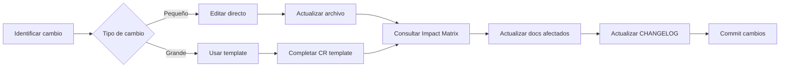

# 📚 Kaelo Documentation System

**Sistema Modular de Documentación sin Reescrituras Completas**

---

## 🎯 Objective

Este sistema te permite mantener la documentación de Kaelo **viva y actualizada** sin necesidad de reescribir documentos completos. Cada cambio se registra en archivos específicos, manteniendo un historial limpio y auditable.

---

## 📁 Estructura del Sistema

```
/docs
├── 01-project-overview.md        # Identificación, Objetivos, Market Research
├── 02-requirements.md             # Funcionales + No-funcionales
├── 03-architecture.md             # Stack, Diagramas, Data Model
├── 04-edge-cases.md               # Manejo de casos críticos
├── 05-testing-strategy.md         # Test Pyramid, Scenarios
├── 06-risk-management.md          # Risks, Timeline, KPIs
├── 07-monitoring.md               # Métricas, Alertas, Observability
├── 08-competitive-analysis.md     # Competidores, UVP
├── 09-security.md                 # RLS Policies, Legal, GDPR
├── 10-deployment.md               # CI/CD, Environments
├── 11-budget.md                   # Costos Infrastructure
├── CHANGELOG.md                   # Control de versiones centralizado
├── INDEX.md                       # Tabla de contenidos con links
├── IMPACT-MATRIX.md               # Matriz de impacto de cambios
├── README.md                      # Este archivo
└── templates/
    ├── CHANGE-REQUEST.md          # Template para cambios generales
    ├── REQUIREMENT-CHANGE.md      # Template para requirements
    ├── METRIC-CHANGE.md           # Template para métricas
    └── EDGE-CASE.md               # Template para edge cases
```

---

## 🚀 Quick Start

### 1. **Primer Uso**

```bash
# Navegar a la carpeta de docs
cd /mnt/kaelo/docs

# Ver el índice completo
cat INDEX.md

# Leer un módulo específico
cat 01-project-overview.md
```

### 2. **Buscar Información**

```bash
# Buscar por keyword en todos los documentos
grep -r "payment" *.md

# Buscar en un documento específico
grep "requirement" 02-requirements.md
```

### 3. **Ver Historial de Cambios**

```bash
# Ver changelog completo
cat CHANGELOG.md

# Ver solo últimas entradas
head -n 50 CHANGELOG.md
```

---

## 🔄 Cómo Hacer Cambios

### Workflow General



### Paso a Paso

#### ✅ OPCIÓN A: Cambio Pequeño (< 5 líneas)

**Ejemplo:** Corregir typo, actualizar una fecha, cambiar un número

1. **Editar directamente** el archivo afectado
2. **Consultar** [IMPACT-MATRIX.md](./IMPACT-MATRIX.md) para ver si afecta otros docs
3. **Actualizar** [CHANGELOG.md](./CHANGELOG.md) con una línea en "Fixed" o "Changed"
4. **Commit** con mensaje descriptivo

```bash
# Ejemplo
echo "- Fixed typo en RF-006 acceptance criteria" >> CHANGELOG.md
git add 02-requirements.md CHANGELOG.md
git commit -m "docs(requirements): fix typo in RF-006"
```

#### ⚠️ OPCIÓN B: Cambio Mediano (Múltiples secciones)

**Ejemplo:** Cambiar un requirement, actualizar una métrica

1. **Copiar template** relevante de `/templates`
2. **Completar template** con detalles del cambio
3. **Seguir checklist** del template
4. **Actualizar** todos los documentos marcados
5. **Actualizar** CHANGELOG con entry detallada
6. **Solicitar review** al asesor (si es crítico)

```bash
# Ejemplo: Cambiar requirement
cp templates/REQUIREMENT-CHANGE.md changes/RC-001-add-notes-field.md

# Editar template
# ... completar todos los campos ...

# Implementar cambios según template
# ... editar 02-requirements.md, 03-architecture.md, etc. ...

# Actualizar CHANGELOG
# ... agregar entry completa ...

# Commit
git add .
git commit -m "docs: add special_notes field to orders (RC-001)"
```

#### 🔴 OPCIÓN C: Cambio Mayor (Arquitectural/Breaking)

**Ejemplo:** Cambiar tech stack, modificar data model significativamente

1. **Crear Change Request** usando [templates/CHANGE-REQUEST.md](./templates/CHANGE-REQUEST.md)
2. **Documentar** impacto completo en CR
3. **Obtener aprobación** del asesor ANTES de implementar
4. **Implementar cambios** siguiendo el CR
5. **Actualizar** CHANGELOG con entry completa (puede ser nueva versión MAJOR)
6. **Documentar decisiones** en retrospective

---

## 📊 Usando la Impact Matrix

La [IMPACT-MATRIX.md](./IMPACT-MATRIX.md) te dice **qué documentos actualizar** cuando haces un cambio.

### Ejemplo de Uso:

**Situación:** Quieres cambiar el API latency target de <500ms a <300ms

**Paso 1:** Busca en la matriz

```markdown
| Tipo de Cambio | ... | Monitoring | ... |
|----------------|-----|------------|-----|
| Nueva métrica SLI | ... | ✅ | ... |
```

**Paso 2:** Identifica documentos marcados con ✅ o ⚠️

- ✅ [07-monitoring.md](./07-monitoring.md) - DEBE actualizarse
- ⚠️ [06-risk-management.md](./06-risk-management.md) - Revisar si afecta KPIs

**Paso 3:** Actualiza solo esos documentos

---

## 📝 Templates Disponibles

### 1. [CHANGE-REQUEST.md](./templates/CHANGE-REQUEST.md)
**Cuándo usar:** Cambios mayores que afectan múltiples documentos

**Incluye:**
- Description completa
- Impact analysis
- Acceptance criteria
- Aprobaciones

### 2. [REQUIREMENT-CHANGE.md](./templates/REQUIREMENT-CHANGE.md)
**Cuándo usar:** Modificar/agregar/eliminar requirements (RF-XXX / RNF-XXX)

**Incluye:**
- Before/After comparison
- Justification
- Implementation checklist

### 3. [METRIC-CHANGE.md](./templates/METRIC-CHANGE.md)
**Cuándo usar:** Cambiar targets, thresholds, o agregar nuevas métricas

**Incluye:**
- Old vs New values
- Justification con data
- Alerting configuration

### 4. [EDGE-CASE.md](./templates/EDGE-CASE.md)
**Cuándo usar:** Documentar nuevo edge case descubierto

**Incluye:**
- Scenario step-by-step
- Mitigation strategy con código
- Testing strategy

---

## 🎯 Best Practices

### ✅ DO

- **Usa templates** para cambios medianos/grandes
- **Actualiza CHANGELOG** en CADA cambio
- **Consulta Impact Matrix** antes de editar
- **Commit frecuentemente** con mensajes descriptivos
- **Mantén archivos <500 líneas** (divide si crece mucho)
- **Linkea documentos relacionados** al final de cada archivo

### ❌ DON'T

- **No reescribas** documentos completos innecesariamente
- **No ignores** CHANGELOG (es tu historial)
- **No cambies** múltiples cosas en un solo commit
- **No olvides** actualizar docs relacionados (usa Impact Matrix)
- **No elimines** versiones antiguas del CHANGELOG
- **No uses** rutas absolutas en links (usa `./` relativas)

---

## 🔍 Tips de Búsqueda

### Buscar por Keyword

```bash
# Buscar "payment" en todos los markdown
grep -r "payment" *.md

# Buscar case-insensitive
grep -ri "PAYMENT" *.md

# Buscar con contexto (3 líneas antes/después)
grep -C 3 "payment" *.md
```

### Buscar Requirements

```bash
# Buscar requirement específico
grep "RF-006" 02-requirements.md

# Buscar todos los P0 requirements
grep "P0" 02-requirements.md
```

### Buscar Cambios Recientes

```bash
# Ver últimos cambios en CHANGELOG
head -n 100 CHANGELOG.md

# Ver cambios de una versión específica
sed -n '/## \[1.1\]/,/## \[1.0\]/p' CHANGELOG.md
```

---

## 🔗 Git Integration (Recomendado)

### Setup Inicial

```bash
# Inicializar git en /docs
cd /mnt/kaelo/docs
git init

# Agregar todos los archivos
git add .
git commit -m "docs: initial modular documentation v1.1"
```

### Conventional Commits

Usa este formato para commits:

```
<type>(<scope>): <message>

docs(requirements): add special_notes field to RF-006
docs(architecture): update PostgreSQL schema for orders
docs(changelog): add v1.2 release notes
fix(monitoring): correct API latency target typo
```

**Types:**
- `docs`: Documentation changes
- `feat`: New documentation section
- `fix`: Fix errors in docs
- `refactor`: Reorganize without changing content
- `style`: Formatting only

### Branching Strategy

```bash
# Feature branch para cambios grandes
git checkout -b docs/add-payment-edge-case

# Hacer cambios...
git add 04-edge-cases.md CHANGELOG.md
git commit -m "docs(edge-cases): add payment timeout scenario"

# Merge a main
git checkout main
git merge docs/add-payment-edge-case
```

---

## 📈 Métricas del Sistema

### Indicadores de Salud de la Documentación

- ✅ **Actualización frecuente:** CHANGELOG tiene entries recientes
- ✅ **Modularidad:** Ningún archivo >1000 líneas
- ✅ **Trazabilidad:** Cada cambio tiene entry en CHANGELOG
- ✅ **Cross-referencing:** Links entre documentos relacionados funcionan
- ✅ **Completeness:** Todos los requirements tienen tests y edge cases documentados

### Review Checklist (Mensual)

- [ ] CHANGELOG tiene entries de último mes
- [ ] Todos los TODOs están resueltos o documentados
- [ ] Links internos funcionan
- [ ] Versiones en documentos coinciden con CHANGELOG
- [ ] Templates están actualizados

---

## 🆘 Troubleshooting

### "No sé qué archivo editar"

1. Consulta [INDEX.md](./INDEX.md) para overview
2. Usa [IMPACT-MATRIX.md](./IMPACT-MATRIX.md) para identificar docs afectados
3. Busca por keyword con `grep -r "keyword" *.md`

### "Cambié algo pero no sé si afecta otros docs"

1. Abre [IMPACT-MATRIX.md](./IMPACT-MATRIX.md)
2. Encuentra tu tipo de cambio en la tabla
3. Actualiza todos los docs con ✅ o ⚠️

### "Quiero revertir un cambio"

```bash
# Ver historial de un archivo
git log 02-requirements.md

# Revertir a versión anterior
git checkout <commit-hash> 02-requirements.md

# O usar git revert
git revert <commit-hash>
```

### "El sistema es muy complejo"

Para cambios pequeños (typos, fechas, números):
1. Edita el archivo directamente
2. Agrega UNA línea a CHANGELOG
3. Commit

No necesitas templates para todo!

---

## 📞 Support

**Desarrollador:** Jonathan Aaron Pérez Méndez
**Email:** jonathanaaronpm19@gmail.com
**Asesor:** Carlos Canto Bonilla

### Recursos

- [Conventional Commits](https://www.conventionalcommits.org/)
- [Keep a Changelog](https://keepachangelog.com/)
- [Semantic Versioning](https://semver.org/)

---

## 📜 License & Attribution

Este sistema de documentación modular fue diseñado específicamente para el proyecto académico **Kaelo - Plataforma de Cicloturismo y Economía Local en Yucatán**.

**Creado:** Enero 2026
**Última Actualización:** 2026-01-27
**Versión:** 1.0

---

## 🎓 Para el Asesor

Este sistema modular facilita:

1. **Revisión incremental:** Solo revisa cambios en CHANGELOG
2. **Trazabilidad:** Cada decisión está documentada
3. **Auditoría:** Git history completo de evolución del proyecto
4. **Evaluación:** Fácil ver progreso y decisiones técnicas

**Para revisar progreso:**
```bash
# Ver cambios desde última revisión
git log --since="2 weeks ago" --oneline

# Ver CHANGELOG
cat CHANGELOG.md
```

---

**Happy Documenting! 🚀**
